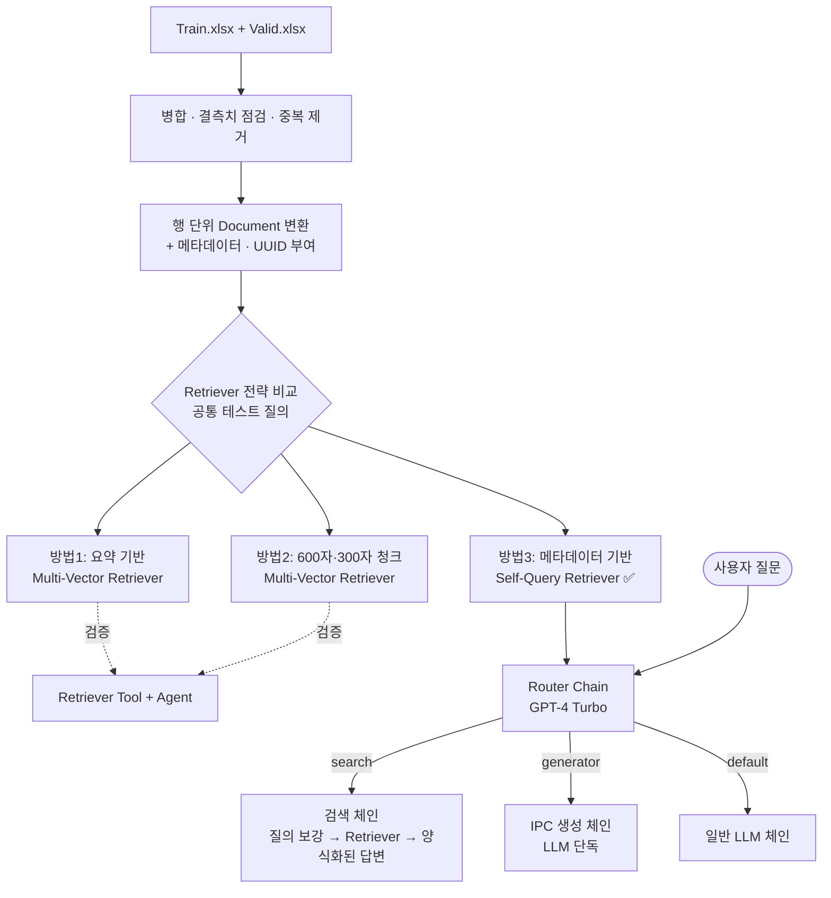

# 특허 정보 검색 · IPC 코드 생성 RAG 시스템

> **DS학술제 모델링 경진대회(2024.11) 장려상** · 팀 프로젝트
> LangChain 기반 RAG(Retrieval-Augmented Generation)로 **특허 데이터 검색**과 **IPC(국제특허분류) 코드 자동 생성**을 하나의 질의 인터페이스에서 처리하는 시스템

<p>
  
  
  
  
  
</p>

## 한눈에 보기

| | |
|---|---|
| **무엇** | 특허 3,006건(22개 컬럼)을 벡터DB에 넣고, 질문 의도에 따라 **기존 특허 조회**와 **새 발명의 IPC 코드 생성**을 하나의 질의 함수로 처리하는 RAG |
| **내 역할** | 팀 프로젝트 중 **검색 · 생성 로직 코드 전체** (Retriever 3종, Self-Query 메타데이터 설계, LLM 라우터 체인) |
| **핵심 결정** | IPC 코드 · 출원번호처럼 정확히 일치해야 하는 값은 임베딩 유사도로 찾기 어렵다 → **메타데이터 필터 문제로 바꿔** Self-Query Retriever 채택 |
| **결과** | DS학술제 모델링 경진대회 장려상. Retriever 비교는 같은 질의 세트로 한 정성 비교이고 정량 지표는 없다 |

---

## 👥 역할 분담

| 담당 | 내용 |
|---|---|
| 팀원 | 데이터 라벨링 · 데이터 이해(파악) |
| **본인** | 그 외 로직 코드 전체 — Retriever 3종 설계·구현, Self-Query 메타데이터 설계, LLM 라우터 체인, RAG 파이프라인 전체 |

> 이 저장소의 노트북(`RAG_Modeling.ipynb`)은 본인이 담당한 RAG 파이프라인 부분입니다.

---

## 📌 프로젝트 개요

특허 문서는 **발명의 명칭, 요약, 대표청구항** 같은 긴 비정형 텍스트와 **출원번호, 전체 IPC, 출원인, 법적상태** 같은 정형 속성이 섞여 있습니다.
일반적인 벡터 유사도 검색만으로는 `G16H-010/60,[G06Q-010/10, ...]`처럼 **정확히 일치해야 하는 코드 검색**이 잘 되지 않습니다.

이 프로젝트에서는 이 문제를 풀기 위해 **세 가지 Retriever 전략을 직접 구현하고, 같은 테스트 질의로 비교**했습니다. 그다음 IPC 정확 일치 검색이 가장 안정적이었던 전략에 **LLM 라우터 체인**을 붙여 사용자의 질문 의도에 따라 동작이 나뉘도록 했습니다.

| 사용자 의도 | 처리 방식 |
|---|---|
| 🔍 **기존 특허 조회** (내용·IPC·출원인 등) | 벡터DB에서 검색한 뒤 정해진 양식으로 정리 |
| ✨ **신규 IPC 코드 생성** (발명 내용 입력) | LLM이 중요도 순으로 IPC 코드, 한글 분류명, 부여 사유 생성 |
| 💬 **그 외 일반 질문** | 기본 LLM 체인으로 응답 |

---

## 🧭 개발 과정 한눈에 보기

1. **데이터 문서화** — Train·Valid 엑셀 병합, 결측치 점검, 중복 제거 후 행 단위 `Document` + 메타데이터 + UUID 생성
2. **임베딩 구성** — `ko-sroberta-multitask`와 OpenAI `text-embedding-3-large`를 바꿔 끼울 수 있게 구성, 최종적으로 한국어 특화 ko-sroberta 사용
3. **Retriever 3종 구현** — 요약 기반 Multi-Vector / 2단 크기 청크 Multi-Vector / Self-Query
4. **Agent로 검증** — 각 Retriever를 Tool로 감싼 Agent에 같은 질의를 넣어 비교, 도구 설명·시스템 프롬프트를 2차에 걸쳐 수정
5. **최종 전략 선택** — IPC 정확 일치 질의에서 가장 안정적인 Self-Query Retriever 채택
6. **LCEL 라우터 체인으로 전환** — Agent 대신 의도별로 결정적으로 분기하는 `RunnableBranch` 체인 구성, 라우터 단독 점검 후 전체 체인 실행

---

## 🏗️ 시스템 아키텍처



---

## 🔧 기술 스택

| 구분 | 사용 기술 |
|---|---|
| **LLM** | OpenAI `gpt-4-turbo-preview` (Agent·Self-Query·Router·생성), `gpt-4o-mini` (문서 요약) |
| **임베딩** | `jhgan/ko-sroberta-multitask` (KorNLU 학습 한국어 모델, 최종 사용), `text-embedding-3-large` (교체 가능하도록 구성) |
| **프레임워크** | LangChain 0.3 (LCEL, Agents, Retrievers, RunnableBranch) |
| **Vector DB** | ChromaDB (디스크에 영구 저장) |
| **Doc Store** | `LocalFileStore` (Multi-Vector의 부모 문서 저장) |
| **데이터 처리** | pandas, openpyxl |
| **실행 환경** | Google Colab + Google Drive |

---

## 🔬 핵심 구현 내용

### 1. 데이터 문서화
> 데이터 라벨링과 데이터 이해(파악)는 팀원이 담당했고, 본인은 이 데이터를 RAG에 넣을 수 있는 형태로 바꾸는 작업을 맡았습니다.

- 학습용·검증용 엑셀을 합친 뒤 결측치 존재 여부를 점검하고(`isnull`), 중복 행을 제거했습니다(`drop_duplicates`).
- DataFrame의 각 행을 `컬럼명 : 값` 형식의 텍스트로 이어 붙여 LangChain `Document`로 만들었습니다.
- `메인IPC2`, `전체 IPC`, `출원번호`, `등록번호`, `출원인`, `발명자`, `법적상태`를 **메타데이터로 분리**했습니다.
- 문서마다 **UUID(`doc_id`)** 를 부여해 요약·청크(검색용)와 원문(반환용)을 연결했습니다.

### 2. Retriever 전략 3종 비교

#### 방법 1: 요약 기반 Multi-Vector Retriever
- `gpt-4o-mini`로 문서마다 **3문장 bullet 요약**을 만들었습니다. `batch(max_concurrency=5)`로 병렬 처리했습니다.
- 요약 결과를 `pickle`로 캐싱해 **API 호출 비용이 반복해서 들지 않도록** 했습니다.
- 요약문 뒤에 7개 메타 필드를 문자열로 붙여 **벡터 검색용**으로, 원문은 `LocalFileStore`에 **반환용**으로 따로 저장했습니다. (`k=3`)

#### 방법 2: 2단 크기 청크 Multi-Vector Retriever
- `RecursiveCharacterTextSplitter`로 원문을 **600자, 300자** 두 크기로 나누고, **두 크기의 청크를 모두 벡터DB에 색인**했습니다.
- 청크마다 IPC·출원번호 등 메타데이터 문자열과 `doc_id`를 덧붙여, 잘린 조각에서도 **문서를 식별하는 정보가 남도록** 했습니다.
- 어느 청크가 검색되든 `doc_id`로 연결된 **원문 전체**를 돌려줍니다. (`k=10`)

#### 방법 3: Self-Query Retriever (최종 채택) ✅
- 원문 `Document`를 그대로 ChromaDB에 넣고, **8개 필드 전체**(`doc_id` + 메타 7개)를 metadata로 유지했습니다.
- `AttributeInfo`로 메타데이터 필드 8개의 의미를 LLM에 설명했습니다. `전체 IPC` 설명에는 "IPC가 포함된 요청은 전체 IPC로 정확히 일치하는 데이터를 먼저 찾고, 그다음 메인IPC2를 검색하라"는 규칙을 넣었습니다.
- LLM이 자연어 질문을 **"의미 검색어 + 메타데이터 필터"** 로 나눠 구조화된 쿼리를 만듭니다.
- `전체 IPC`처럼 **정확히 일치해야 하는 값은 필터로 처리**해서, 유사도 검색만 쓸 때의 한계를 보완했습니다.

```python
retriever03 = SelfQueryRetriever.from_llm(
    llm=llm,
    vectorstore=vectorstore03,
    metadata_field_info=metadata_field_info,   # 전체 IPC, 출원인, 법적상태 등 8개 필드
    document_contents="특허 정보를 가지고 있다",
)
```

#### 비교 방법과 선택 이유
세 방법에 **같은 테스트 질의 세트**를 넣고 반환 문서를 직접 확인해 비교했습니다. **정량 지표(Hit Rate 등)는 사용하지 않은 정성 비교**입니다.

| 테스트 질의 유형 | 예시 |
|---|---|
| 전체 IPC 정확 일치 | `전체 IPC 가 G16H-010/60,[G06Q-010/10, G16H-010/20, G16H-080/00] 와 정확히 일치하는 특허` |
| 긴 IPC 문자열 조회 | `G16H-050/20,[A61B-005/00, ...]` 인 정보를 알려줘 |
| 발명 설명문 유사 검색 | 유해인자·질병위험도 예측, 기능성 위장관질환 음식 조절 서비스 설명문 |
| 메타 조건 검색 | `메인IPC2 G06Q 인 특허 1개`, 출원인 지정 검색 |
| 주제 검색 + 요약 | `인공지능과 관련한 특허 3개만 50자 이내로 요약` |

방법 1·2는 벡터 텍스트에 메타 필드를 모두 붙였지만 metadata에는 4개(`doc_id`, `메인IPC2`, `전체 IPC`, `출원번호`)만 두었습니다. 그래서 IPC 같은 긴 코드 문자열도 **유사도 검색에만 의존**합니다. 방법 3은 8개 필드를 모두 metadata로 두어 **LLM이 필터로 바로 쓸 수 있어서**, IPC 정확 일치 질의에서 가장 안정적이었습니다. 이 점을 근거로 최종 채택했습니다.

### 3. Agent 구성 (방법 1·2 검증용)
- `create_retriever_tool`로 Retriever를 Tool로 감싸고, **OpenAI Functions Agent**를 만들었습니다.
- `RunnableWithMessageHistory`로 **세션별 대화 기록**을 유지해 멀티턴 대화가 가능합니다.
- 프롬프트는 **2차에 걸쳐 수정**했습니다.
  - 1차: 도구 설명에 "IPC가 있으면 답변에도 같은 IPC가 포함되어야 한다", 시스템 프롬프트에 "IPC가 있으면 IPC 문자열로 검색하라" 한 줄 규칙
  - 2차: 시스템 프롬프트를 "특허 전문가" 역할 + 3단계 규칙(IPC 있으면 전체 IPC 정확 일치 검색·출력에 전체 IPC 포함 / 없으면 유사 특허 검색 / 정보가 없으면 직접 생성)으로 구체화하고, 도구 설명도 같은 규칙으로 맞췄습니다.
- 2차에서는 에이전트를 `create_openai_functions_agent`에서 **`create_openai_tools_agent`로 바꿔** 시험했습니다.

### 4. LLM Router 기반 최종 체인
Agent는 도구 호출 여부와 순서를 LLM이 정하므로, 조회와 생성을 **항상 같은 경로로 분기**하기 어렵습니다. 그래서 최종 단계에서는 Agent 대신 LCEL의 `RunnableBranch`로 질문 의도에 맞는 체인을 고르는 **라우터 체인**으로 전환했습니다.

```python
router_chain = {"input": itemgetter("input")} | router_prompt | llm | StrOutputParser()

branch = RunnableBranch(
    (lambda x: "search"    in x["destination"].lower(), destination_chains["search"]),
    (lambda x: "generator" in x["destination"].lower(), destination_chains["generator"]),
    default_chain,
)

final_chain = {"input": itemgetter("input"), "destination": router_chain} | branch
```

- **라우터 프롬프트**: `이름: 설명` 형식의 카테고리 목록(search = 기존 정보 조회, generator = 새로운 정보 생성)을 주고, 맞는 것이 없으면 `default`를 한 단어로 반환하게 했습니다.
- **라우터 단독 점검**: 라우터 결과만 뽑는 체인(`router01_chain`)을 따로 만들어, `"정보를 찾아주세요"` 같은 모호한 질의가 어디로 분류되는지 먼저 확인했습니다.
- **search 체인**: `질의 보강 → SelfQueryRetriever → 문서 포맷팅 → 프롬프트 → LLM`
  - 질의 보강: 질문 끝에 `"단, 가장 일치하는 정보를 검색해 주세요"`를 덧붙여 Retriever에 넘깁니다.
  - 문서 포맷팅: 검색된 문서의 본문을 줄바꿈으로 이어 `context`로 넣습니다.
  - 출원번호, 메인IPC, 전체IPC, 요약정보, 법적상태, 등록번호, 출원인을 **정해진 양식으로 출력**합니다. 요약정보가 100자 이상이면 50자 이내로 줄입니다.
  - 정보를 추출하지 못한 항목은 `검색불가`로 표시하게 했습니다.
- **generator 체인**: 검색 없이 **LLM만으로** 발명 내용을 받아 **최대 10개의 IPC 코드**를 중요도 순으로 만들고, 코드마다 한글 분류명과 부여 사유를 함께 출력합니다.
- **default 체인**: `LLMChain`이 dict를 반환하므로, 질의 함수 `question()`에서 `text`만 꺼내도록 처리했습니다.

---

## 📊 실행 결과

> 아래는 **원본 실행 로그 발췌**입니다. 저장소의 노트북은 출력을 지운 상태로 올렸고, 대회 데이터는 포함하지 않습니다. 발췌에 나오는 출원번호·등록번호·출원인은 가렸습니다.

### ① IPC 코드 정확 일치 검색 (Self-Query Retriever 단독 호출)
**질문:** `전체 IPC 가 G16H-010/60,[G06Q-010/10, G16H-010/20, G16H-080/00] 와 정확히 일치하는 특허를 알려주세요`
```
메인IPC2  : G16H
전체 IPC  : G16H-010/60,[G06Q-010/10, G16H-010/20, G16H-080/00]   ← 질문과 정확히 일치
출원번호  : 2019-00○○○○○
출원인    : (가림)
법적상태  : 거절
발명의 명칭 : 병원 고객관리 시스템(customer relationship management in hospital)
```
> 긴 IPC 코드 문자열을 LLM이 메타데이터 필터로 바꿔서 **정확히 일치하는 문서**를 찾아냈습니다.

### ② 발명 내용으로 유사 특허 검색 (최종 체인 → search)
**질문:** `"기능성위장관질환의 증상 조절을 위한 자가완성형 음식 조절 서비스…" 와 관련한 특허 정보를 알려주세요`
```
'출원번호' : 2021-00○○○○○
'메인IPC'  : G16H
'전체IPC'  : G16H-020/60,[A61B-005/00, G06F-016/28, G06Q-010/08, G16H-010/60, G16H-040/67, G16H-050/20, ...]
'요약정보' : 건강검진기기 이용 목표질환 수치 개선용 개인 맞춤형 식단 서비스 제공
'법적상태' : 등록
'등록번호' : 23○○○○○
'출원인'   : (가림)
```
> 식이·건강관리 분야의 관련 특허 4건이 함께 반환되었고, 위는 그중 1건입니다. 모든 결과가 같은 `G16H-020/60` 계열로 분류되었습니다.

### ③ 출원인 조건 검색 (최종 체인 → search)
**질문:** `출원인이 '○○○ 주식회사' 인 특허를 3개 알려줘`
```
'출원번호': 2016-00○○○○○
'메인IPC' : G06F
'전체IPC' : G06F-017/30,[G06F-021/10]
'요약정보': 소프트웨어 소스 자산 분석 및 관리 방법 제공
'법적상태': 등록
```

### ④ 신규 IPC 코드 생성 (최종 체인 → generator)
**질문:** `"…음식 조절 가이드라인을 작성하여 사용자 단말기에게 제공한다." 와 관련한 IPC를 생성해주세요`
```
요약내용 : 기능성위장관질환의 증상 조절을 위한 자가완성형 음식 조절 서비스 제공 시스템 및 방법

IPC : G16H 50/20   한글코드 : 개인화된 건강 데이터 관리
      =====> 코드 부여 이유 : 사용자별 증상 유발 음식 정보를 분석하여 개인화된 건강 관리 서비스를 제공
IPC : G06Q 50/22   한글코드 : 건강관리 서비스
      =====> 코드 부여 이유 : 건강관리 및 예방을 위한 서비스 제공에 관련됨
...
```

---

## 💡 문제 해결 과정 및 배운 점

| 문제 | 해결 |
|---|---|
| 벡터 유사도 검색만으로는 **IPC 코드처럼 정확히 일치해야 하는 값**을 찾기 어려움 | 메타데이터를 따로 분리하고 **Self-Query Retriever**로 LLM이 필터 조건을 만들도록 함 |
| 긴 특허 원문을 청크로 나누면 **어느 문서의 조각인지 알 수 없게 됨** | 청크마다 IPC·출원번호 메타 문자열을 붙이고, UUID로 원문과 연결 |
| 문서마다 LLM 요약을 만드는 데 **비용과 시간**이 많이 듦 | `batch` 병렬 처리로 시간을 줄이고, 결과를 `pickle`에 캐싱해 재사용 |
| 한국어 특허 문서의 **임베딩 품질** | 임베딩 모델을 교체 가능하게 구성하고, 한국어 NLU 데이터로 학습한 `ko-sroberta-multitask`를 사용 |
| Agent는 도구 사용 여부를 LLM이 정해 **조회·생성 경로가 일정하지 않음** | 프롬프트를 2차에 걸쳐 다듬은 뒤, 최종적으로 LLM Router + `RunnableBranch`로 의도별 체인을 결정적으로 분기 |
| 벡터DB·요약을 매번 새로 만들면 **시간과 API 비용**이 큼 | 방법별 저장 경로를 나눠 Google Drive에 영구 저장하고, 저장본이 있으면 생성 셀("SKIP" 표시)을 건너뛰고 불러오기만 실행 |
| LLM이 없는 정보를 지어내는 **환각** | 출력 양식을 고정하고, 추출하지 못한 항목은 `검색불가`로 표시하도록 프롬프트에 명시 (한계는 아래 참고) |

### 검토했으나 채택하지 않은 것

| 대상 | 내용 | 결과 |
|---|---|---|
| `ParentDocumentRetriever` | 부모/자식 분할을 자동으로 해 주는 Retriever | 청크에 메타 문자열을 직접 붙이기 위해 `MultiVectorRetriever`로 직접 구성 |
| `EnsembleRetriever`, `MultiQueryRetriever` | 여러 Retriever 결합 / 질의 다변화 | 불러오기까지만 하고 미적용 (향후 Hybrid Search 과제로 남김) |
| `LLMChainFilter`, `LLMChainExtractor` | 검색 결과 압축·필터링 | 불러오기까지만 하고 미적용 |
| Tavily 웹 검색 도구 | 저장소에 없는 특허를 웹에서 보완 검색 | 도구는 만들었으나 Agent에 연결하지 않음 (참고 코드) |
| `text-embedding-3-large` | OpenAI 임베딩 | 교체 가능하게 구성했으나 최종 벡터DB는 ko-sroberta로 생성 |

### 알려진 한계
- search 프롬프트에 "'제공되는 정보'가 없을 경우에는 당신이 생성합니다"라는 지시가 함께 있어, 검색 결과가 비면 LLM이 내용을 만들어 낼 수 있습니다. `검색불가` 규칙만으로 환각을 막지는 못합니다.
- search 프롬프트 템플릿에 `{question}` 변수가 없어, **사용자 질문 자체는 LLM에 전달되지 않고** 검색된 문서(`context`)만 전달됩니다. 질문은 Retriever 단계에서만 쓰입니다.
- generator 체인은 검색 결과를 쓰지 않으므로, 생성된 IPC 코드가 실제 분류표에 있는지 확인하지 않습니다.
- Retriever 비교는 정성 비교이며 정량 지표가 없습니다.

---

## 🚀 실행 방법

1. Google Colab에서 `RAG_Modeling.ipynb`를 엽니다.
2. Google Drive의 작업 경로(`/content/drive/MyDrive/Colab Notebooks/testdata/contest/`)에 대회 데이터를 넣습니다.
   - `DS학술제-모델링경진대회_Train.xlsx`
   - `DS학술제-모델링경진대회_Valid.xlsx`
3. 패키지를 설치합니다. 노트북 안의 `pip install -U` 셀은 최신 버전(LangChain 1.x)을 설치해 코드가 동작하지 않을 수 있으므로, 그 셀 대신 아래 명령을 사용합니다.
   ```bash
   pip install -r requirements.txt
   ```
   LangChain 1.0에서 제거된 API를 사용하므로 `langchain 0.3.x`로 버전을 고정했습니다.
4. API 키를 등록합니다. 키는 코드에 직접 적지 않습니다.
   - Colab 왼쪽 **보안 비밀(🔑)** 에 `OPENAI_API_KEY`를 등록하고, 이 노트북에서 접근할 수 있도록 허용합니다.
   - Tavily 검색 도구(참고 코드)를 쓰려면 `TAVILY_API_KEY`도 등록합니다.
   - Colab이 아닌 환경에서는 노트북이 환경변수를 읽습니다. `.env.example`을 `.env`로 복사해 값을 채운 뒤, 노트북 첫머리에서 `from dotenv import load_dotenv; load_dotenv()`를 실행하거나 환경변수를 직접 설정합니다. (`.env`는 git에 올라가지 않습니다)
5. 노트북을 순서대로 실행합니다.
   - **Ⅰ. 데이터 정제**, **Ⅲ. 벡터 환경 구성**: 공통으로 실행
   - **Ⅳ. 방법1 ~ 3**: 비교할 방법을 골라 실행합니다. 단, **최종 체인은 방법3의 `retriever03`을 사용하므로 방법3은 반드시 실행**해야 합니다.
   - **라. Chain 생성 및 실행**: `question("질문")`으로 질의하고 `print(result)`로 결과를 봅니다.

### 벡터DB 재사용 · 초기화
- Ⅲ 단계에서 방법별 Chroma 컬렉션을 디스크 경로로 엽니다. **저장된 DB가 있으면 그대로 불러오고**, 이때는 문서 가공·요약·저장 단계(각 절의 "SKIP" 표시)를 건너뜁니다.
- 요약 결과가 `list.pickle`로 저장되어 있으면 요약 생성 대신 불러오기 셀을 실행합니다.
- DB를 처음부터 다시 만들려면 Ⅲ의 초기화 셀에서 해당 컬렉션의 `delete_collection()` 주석을 해제해 실행합니다.

---

## 📁 프로젝트 구조

```
Patent_Classification/
├── RAG_Modeling.ipynb      # 전체 파이프라인 (전처리 → 벡터DB → Retriever → Agent/Chain), 출력 제거본
├── requirements.txt        # 의존성 목록 (LangChain 0.3.x 고정)
├── .env.example            # 환경변수 템플릿
├── .githooks/pre-commit    # 커밋 전 API 키 유출 검사
└── README.md
```

### 🔒 보안
- `.env`, 대회 데이터(`data/`, `*.xlsx`), 벡터DB(`store/`), 요약 캐시(`*.pickle`)는 `.gitignore`로 제외됩니다.
- 클론 후 `git config core.hooksPath .githooks`를 실행하면 커밋할 때 API 키 패턴과 `.env` 파일을 자동으로 검사합니다.

실행하면 다음 산출물이 생성됩니다.
```
store/
├── summarise/   # 방법1: 요약 벡터DB + 원문 저장소(LocalFileStore)
├── samllize/    # 방법2: 청크 벡터DB (노트북의 경로 표기 그대로)
├── smallizer/   # 방법2: 원문 저장소(LocalFileStore)
└── meta/        # 방법3: 메타데이터 기반 벡터DB
list.pickle      # LLM 요약 결과 캐시
```

---

## 🔭 향후 개선 방향
- **평가 지표 도입**: Hit Rate, MRR 등으로 세 Retriever의 성능을 수치로 비교
- **Hybrid Search**: BM25(키워드)와 Dense(벡터)를 합친 `EnsembleRetriever` 적용
- **Re-ranking**: Cross-Encoder로 검색 결과 재정렬
- **프롬프트 보완**: search 프롬프트에 사용자 질문(`{question}`) 전달, 검색 결과가 없을 때 생성하지 않도록 수정
- **IPC 생성 검증**: 생성된 코드를 실제 IPC 분류표와 대조하는 검증 단계 추가
- **서비스화**: Streamlit이나 FastAPI로 웹 인터페이스 제공
