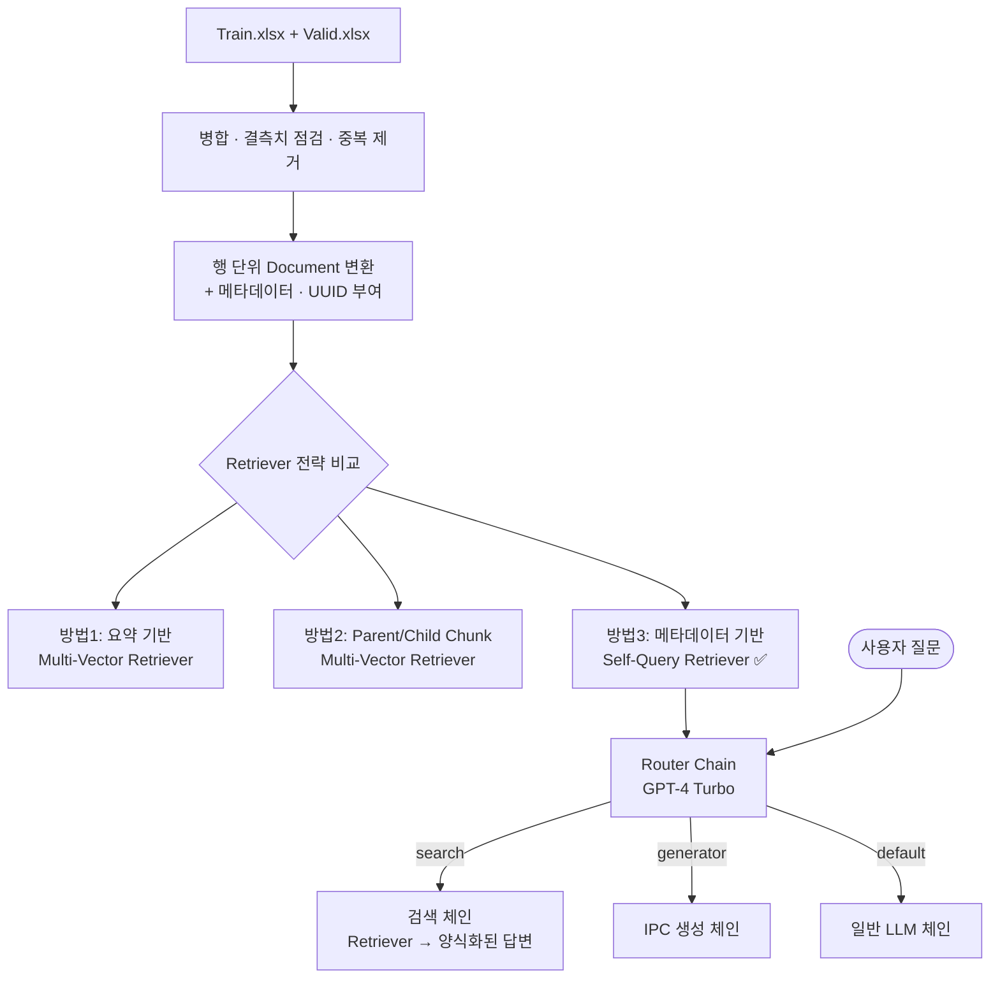

# 특허 정보 검색 · IPC 코드 생성 RAG 시스템

> **DS학술제 모델링 경진대회** 출품작
> LangChain 기반 RAG(Retrieval-Augmented Generation)로 **특허 데이터 검색**과 **IPC(국제특허분류) 코드 자동 생성**을 하나의 질의 인터페이스에서 처리하는 시스템

<p>
  
  
  
  
  
  
</p>

---

## 📌 프로젝트 개요

특허 문서는 **발명의 명칭, 요약, 대표청구항** 같은 긴 비정형 텍스트와 **출원번호, 전체 IPC, 출원인, 법적상태** 같은 정형 속성이 섞여 있습니다.
일반적인 벡터 유사도 검색만으로는 `G16H-010/60,[G06Q-010/10, ...]`처럼 **정확히 일치해야 하는 코드 검색**이 잘 되지 않습니다.

이 프로젝트에서는 이 문제를 풀기 위해 **세 가지 Retriever 전략을 직접 구현하고 비교**했습니다. 그다음 가장 정확한 전략에 **LLM 라우터 체인**을 붙여 사용자의 질문 의도에 따라 동작이 나뉘도록 했습니다.

| 사용자 의도 | 처리 방식 |
|---|---|
| 🔍 **기존 특허 조회** (내용·IPC·출원인 등) | 벡터DB에서 검색한 뒤 정해진 양식으로 정리 |
| ✨ **신규 IPC 코드 생성** (발명 내용 입력) | LLM이 중요도 순으로 IPC 코드, 한글 분류명, 부여 사유 생성 |
| 💬 **그 외 일반 질문** | 기본 LLM 체인으로 응답 |

---

## 🏗️ 시스템 아키텍처



---

## 🔧 기술 스택

| 구분 | 사용 기술 |
|---|---|
| **LLM** | OpenAI `gpt-4-turbo-preview` (Agent·Router·생성), `gpt-4o-mini` (문서 요약) |
| **임베딩** | `jhgan/ko-sroberta-multitask` (KorNLU 학습 한국어 모델), `text-embedding-3-large` (비교용) |
| **프레임워크** | LangChain (LCEL, Agents, Retrievers, RunnableBranch) |
| **Vector DB** | ChromaDB (디스크에 영구 저장) |
| **Doc Store** | `LocalFileStore` (Multi-Vector의 부모 문서 저장) |
| **데이터 처리** | pandas, openpyxl |
| **실행 환경** | Google Colab + Google Drive |

---

## 🔬 핵심 구현 내용

### 1. 데이터 전처리 및 문서화
- 학습용·검증용 엑셀 데이터를 합친 뒤 **결측치를 점검하고 중복 행을 제거**했습니다.
- DataFrame의 각 행을 `컬럼명 : 값` 형식의 텍스트로 이어 붙여 LangChain `Document`로 만들었습니다.
- `메인IPC2`, `전체 IPC`, `출원번호`, `등록번호`, `출원인`, `발명자`, `법적상태`를 **메타데이터로 분리**했습니다.
- 문서마다 **UUID(`doc_id`)** 를 부여해 요약·청크(자식)와 원문(부모)을 연결했습니다.

### 2. Retriever 전략 3종 비교

#### 방법 1: 요약 기반 Multi-Vector Retriever
- `gpt-4o-mini`로 문서마다 **3문장 bullet 요약**을 만들었습니다. `batch(max_concurrency=5)`로 병렬 처리했습니다.
- 요약 결과를 `pickle`로 캐싱해 **API 호출 비용이 반복해서 들지 않도록** 했습니다.
- 요약문과 핵심 메타데이터는 **벡터 검색용(자식)** 으로, 원문은 **반환용(부모)** 으로 따로 저장했습니다.

#### 방법 2: Parent / Child Chunk Multi-Vector Retriever
- `RecursiveCharacterTextSplitter`로 원문을 **600자(부모)와 300자(자식)** 두 단위로 나눴습니다.
- 청크마다 IPC·출원번호 등 메타데이터 문자열을 덧붙여, 잘린 조각에서도 **문서를 식별하는 정보가 남도록** 했습니다.
- 작은 청크로 검색 정확도를 높이고, 결과는 원문 문서로 돌려줍니다.

#### 방법 3: Self-Query Retriever (최종 채택) ✅
- `AttributeInfo`로 메타데이터 필드 8개의 의미를 LLM에 설명했습니다.
- LLM이 자연어 질문을 **"의미 검색어 + 메타데이터 필터"** 로 나눠 구조화된 쿼리를 만듭니다.
- `전체 IPC`처럼 **정확히 일치해야 하는 값은 필터로 처리**해서, 유사도 검색만 쓸 때의 한계를 보완했습니다.

```python
retriever03 = SelfQueryRetriever.from_llm(
    llm=llm,
    vectorstore=vectorstore03,
    metadata_field_info=metadata_field_info,   # 전체 IPC, 출원인, 법적상태 등 8개 필드
    document_contents="특허 정보를 가지고 있다",
)
```

### 3. Agent 구성 (방법 1·2 검증용)
- `create_retriever_tool`로 Retriever를 Tool로 감싸고, **OpenAI Functions Agent**를 만들었습니다.
- `RunnableWithMessageHistory`로 **세션별 대화 기록**을 유지해 멀티턴 대화가 가능합니다.
- 시스템 프롬프트에 **"질문에 IPC가 있으면 IPC 문자열로 검색하라"** 는 규칙을 넣었습니다.

### 4. LLM Router 기반 최종 체인
LCEL의 `RunnableBranch`로 질문 의도에 맞는 체인을 자동으로 고릅니다.

```python
router_chain = {"input": itemgetter("input")} | router_prompt | llm | StrOutputParser()

branch = RunnableBranch(
    (lambda x: "search"    in x["destination"].lower(), destination_chains["search"]),
    (lambda x: "generator" in x["destination"].lower(), destination_chains["generator"]),
    default_chain,
)

final_chain = {"input": itemgetter("input"), "destination": router_chain} | branch
```

- **search 체인**: `query 보강 → SelfQueryRetriever → 문서 포맷팅 → 프롬프트 → LLM`
  - 출원번호, 메인IPC, 전체IPC, 요약정보(50자 이내), 법적상태, 등록번호, 출원인을 **정해진 양식으로 출력**합니다.
  - 정보를 찾지 못한 항목은 `검색불가`로 표시해 **환각을 줄였습니다**.
- **generator 체인**: 발명 내용을 받아 **최대 10개의 IPC 코드**를 중요도 순으로 만들고, 코드마다 한글 분류명과 부여 사유를 함께 출력합니다.

---

## 📊 실행 결과

### ① IPC 코드 정확 일치 검색 (Self-Query Retriever)
**질문:** `전체 IPC 가 G16H-010/60,[G06Q-010/10, G16H-010/20, G16H-080/00] 와 정확히 일치하는 특허를 알려주세요`
```
메인IPC2  : G16H
전체 IPC  : G16H-010/60,[G06Q-010/10, G16H-010/20, G16H-080/00]   ← 질문과 정확히 일치
출원번호  : 2019-0042279
출원인    : 주식회사 마케팅위너
법적상태  : 거절
발명의 명칭 : 병원 고객관리 시스템(customer relationship management in hospital)
```
> 긴 IPC 코드 문자열을 LLM이 메타데이터 필터로 바꿔서 **정확히 일치하는 문서**를 찾아냈습니다.

### ② 발명 내용으로 유사 특허 검색
**질문:** `"기능성위장관질환의 증상 조절을 위한 자가완성형 음식 조절 서비스…" 와 관련한 특허 정보를 알려주세요`
```
'출원번호' : 2021-0077124
'메인IPC'  : G16H
'전체IPC'  : G16H-020/60,[A61B-005/00, G06F-016/28, G06Q-010/08, G16H-010/60, G16H-040/67, G16H-050/20, ...]
'요약정보' : 건강검진기기 이용 목표질환 수치 개선용 개인 맞춤형 식단 서비스 제공
'법적상태' : 등록
'등록번호' : 2354400
'출원인'   : 메디프레쉬주식회사
```
> 식이·건강관리 분야의 관련 특허 4건이 함께 반환되었고, 위는 그중 1건입니다. 모든 결과가 같은 `G16H-020/60` 계열로 분류되었습니다.

### ③ 출원인 조건 검색
**질문:** `출원인이 '티쓰리큐 주식회사' 인 특허를 3개 알려줘`
```
'출원번호': 2016-0073377
'메인IPC' : G06F
'전체IPC' : G06F-017/30,[G06F-021/10]
'요약정보': 소프트웨어 소스 자산 분석 및 관리 방법 제공
'법적상태': 등록
```

### ④ 신규 IPC 코드 생성
**질문:** `"…음식 조절 가이드라인을 작성하여 사용자 단말기에게 제공한다." 와 관련한 IPC를 생성해주세요`
```
요약내용 : 기능성위장관질환의 증상 조절을 위한 자가완성형 음식 조절 서비스 제공 시스템 및 방법

IPC : G16H 50/20   한글코드 : 개인화된 건강 데이터 관리
      =====> 코드 부여 이유 : 사용자별 증상 유발 음식 정보를 분석하여 개인화된 건강 관리 서비스를 제공
IPC : G06Q 50/22   한글코드 : 건강관리 서비스
      =====> 코드 부여 이유 : 건강관리 및 예방을 위한 서비스 제공에 관련됨
...
```

---

## 💡 문제 해결 과정 및 배운 점

| 문제 | 해결 |
|---|---|
| 벡터 유사도 검색만으로는 **IPC 코드처럼 정확히 일치해야 하는 값**을 찾기 어려움 | 메타데이터를 따로 분리하고 **Self-Query Retriever**로 LLM이 필터 조건을 만들도록 함 |
| 긴 특허 원문을 청크로 나누면 **어느 문서의 조각인지 알 수 없게 됨** | 청크마다 IPC·출원번호 메타 문자열을 붙이고, UUID로 부모 문서와 연결 |
| 문서마다 LLM 요약을 만드는 데 **비용과 시간**이 많이 듦 | `batch` 병렬 처리로 시간을 줄이고, 결과를 `pickle`에 캐싱해 재사용 |
| 한국어 특허 문서의 **임베딩 품질** | 한국어 NLU 데이터로 학습한 `ko-sroberta-multitask`와 OpenAI 임베딩을 비교해 적용 |
| 조회와 생성이라는 **서로 다른 요구**를 하나의 인터페이스에서 처리 | LLM Router와 `RunnableBranch`로 의도별 체인 분기 |
| LLM이 없는 정보를 지어내는 **환각** | 출력 양식을 고정하고, 찾지 못한 항목은 `검색불가`로 표시하도록 프롬프트에 명시 |

---

## 🚀 실행 방법

1. Google Colab에서 `RAG_Modeling.ipynb`를 엽니다.
2. Google Drive의 작업 경로에 대회 데이터를 넣습니다.
   - `DS학술제-모델링경진대회_Train.xlsx`
   - `DS학술제-모델링경진대회_Valid.xlsx`
3. API 키를 등록합니다. 키는 코드에 직접 적지 않습니다.
   - Colab 왼쪽 **보안 비밀(🔑)** 에 `OPENAI_API_KEY`를 등록하고, 이 노트북에서 접근할 수 있도록 허용합니다.
   - Tavily 검색 도구(참고 코드)를 쓰려면 `TAVILY_API_KEY`도 등록합니다.
   - Colab이 아닌 환경에서는 `.env.example`을 `.env`로 복사해 값을 채웁니다. (`.env`는 git에 올라가지 않습니다)
4. 노트북을 순서대로 실행합니다.
   - **Ⅰ. 데이터 정제**, **Ⅲ. 벡터 환경 구성**: 공통으로 실행
   - **Ⅳ. 방법1 ~ 3**: 하나를 골라 실행 (이미 만든 벡터DB나 요약 캐시가 있으면 생성 단계는 건너뛰기)
   - **라. Chain 생성 및 실행**: `question("질문")`으로 질의

### 주요 패키지
```bash
pip install -r requirements.txt
```
LangChain 1.0에서 제거된 API를 사용하므로 `langchain 0.3.x`로 버전을 고정했습니다.

---

## 📁 프로젝트 구조

```
RAG_modeling/
├── RAG_Modeling.ipynb      # 전체 파이프라인 (전처리 → 벡터DB → Retriever → Agent/Chain)
├── src/patent_rag/         # 노트북 코드를 모듈로 정리한 패키지
├── requirements.txt        # 의존성 목록 (버전 범위 고정)
├── .env.example            # 환경변수 템플릿
├── .githooks/pre-commit    # 커밋 전 API 키 유출 검사
└── README.md
```

### 🔒 보안
- `.env`, 대회 데이터(`data/`, `*.xlsx`), 벡터DB(`store/`)는 `.gitignore`로 제외됩니다.
- 클론 후 `git config core.hooksPath .githooks`를 실행하면 커밋할 때 API 키 패턴과 `.env` 파일을 자동으로 검사합니다.

실행하면 다음 산출물이 생성됩니다.
```
store/
├── summarise/   # 방법1: 요약 기반 벡터DB + 부모 문서 저장소
├── smallizer/   # 방법2: Parent/Child 청크 벡터DB
└── meta/        # 방법3: 메타데이터 기반 벡터DB
list.pickle      # LLM 요약 결과 캐시
```

---

## 🔭 향후 개선 방향
- **평가 지표 도입**: Hit Rate, MRR 등으로 세 Retriever의 성능을 수치로 비교
- **Hybrid Search**: BM25(키워드)와 Dense(벡터)를 합친 `EnsembleRetriever` 적용
- **Re-ranking**: Cross-Encoder로 검색 결과 재정렬
- **IPC 생성 검증**: 생성된 코드를 실제 IPC 분류표와 대조하는 검증 단계 추가
- **서비스화**: Streamlit이나 FastAPI로 웹 인터페이스 제공
