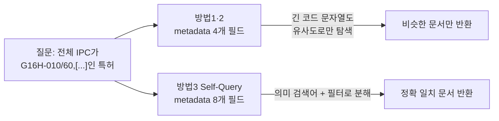
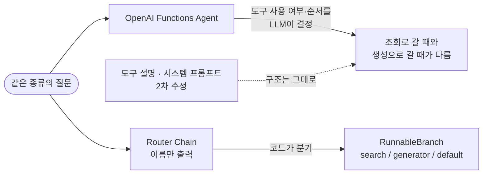
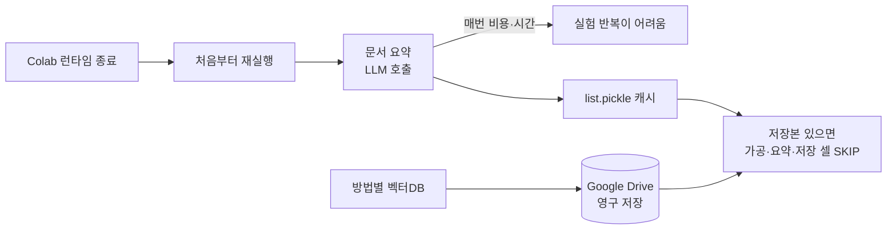

# 특허 검색 · IPC 코드 생성 RAG 시스템

특허 3,006건을 벡터DB에 넣고, 질문 의도에 따라 기존 특허 조회와 새 발명의 IPC 코드 생성을 하나의 질의 함수로 처리하는 시스템입니다.

<p>
  
  
  
  
  
</p>

## 프로젝트 목적

특허 문서에는 성격이 다른 두 종류의 값이 섞여 있습니다. 발명의 명칭, 요약, 대표청구항은 긴 글이라 의미로 찾아야 하고, 출원번호와 전체 IPC, 출원인, 법적상태는 정확히 맞아야 합니다. `G16H-010/60,[G06Q-010/10, G16H-010/20, G16H-080/00]` 같은 코드를 벡터 유사도로 찾으면 비슷한 문서는 나와도 정확히 같은 코드인지는 보장되지 않습니다.

두 가지를 한 질의에서 처리하는 것이 목표였습니다. 정확 일치 조건은 메타데이터 필터로 넘기고 의미 검색만 임베딩에 맡기면, 사용자는 조건을 나눠 입력하지 않아도 됩니다. 여기에 아직 출원하지 않은 발명의 설명을 넣으면 IPC 코드를 만들어 주는 경로를 붙였습니다.

2024년 9월부터 11월까지 2인 팀으로 진행했고, 강남대학교 DS학술제 모델링 경진대회에서 장려상을 받았습니다. 저는 검색과 생성 로직 코드 전체를, 팀원은 데이터 라벨링과 데이터 파악을 맡았습니다.

## 사용 기술 스택

| 구분 | 기술 | 선택한 이유 |
| --- | --- | --- |
| 언어 | Python | |
| 프레임워크 | LangChain 0.3 (LCEL, Agents, Retrievers, `RunnableBranch`), pandas, openpyxl | Retriever 여러 종을 같은 인터페이스로 바꿔 끼우며 비교하려고 썼습니다 |
| 벡터 저장 | ChromaDB (디스크 영구 저장), `LocalFileStore` | Colab 런타임이 끊겨도 Drive에 남은 벡터DB를 다시 불러 쓰려고 디스크 저장을 썼습니다 |
| 모델 | OpenAI `gpt-4-turbo-preview` (Agent · Self-Query · Router · 생성), `gpt-4o-mini` (문서 요약) | 요약은 건수가 많아 저렴한 모델로, 질의 분해와 생성은 상위 모델로 나눴습니다 |
| 임베딩 | `jhgan/ko-sroberta-multitask` | 특허 원문이 한국어라 한국어 문장 임베딩을 썼습니다 |
| 환경 | Google Colab + Google Drive | |

## 아키텍처 구조


```mermaid
flowchart TD
    A[Train.xlsx + Valid.xlsx] --> B[병합 · 결측치 점검 · 중복 제거]
    B --> C[행 단위 Document 변환<br/>메타데이터 8개 · UUID 부여]
    C --> D{Retriever 전략 비교<br/>공통 테스트 질의}

    D --> E1[방법1 요약 기반<br/>Multi-Vector]
    D --> E2[방법2 600자·300자 청크<br/>Multi-Vector]
    D --> E3[방법3 메타데이터 기반<br/>Self-Query · 채택]

    E1 -.검증.-> AG[Retriever Tool + Agent]
    E2 -.검증.-> AG

    E3 --> F[Router Chain<br/>GPT-4 Turbo]
    U([사용자 질문]) --> F
    F -->|search| G[검색 체인<br/>질의 보강 → Retriever → 양식화된 답변]
    F -->|generator| H[IPC 생성 체인<br/>LLM 단독]
    F -->|default| I[일반 LLM 체인]
```

질문은 라우터가 `search` · `generator` · `default` 중 하나로 분류하고, 그 이름대로 코드가 체인을 나눕니다. 검색 체인은 Self-Query Retriever가 질문을 "의미 검색어 + 메타데이터 필터"로 분해한 결과로 문서를 찾고, 출원번호 · 메인IPC · 전체IPC · 요약정보 · 법적상태 · 등록번호 · 출원인을 정해진 양식으로 답합니다.

## 역할과 기여도

검색과 생성 로직 코드 전체를 담당했습니다.

- 특허 3,006건(22개 컬럼)을 행 단위 Document로 바꾸고 메타데이터 8개 필드와 UUID를 설계했습니다.
- Retriever 3종을 직접 구현하고 같은 테스트 질의 세트로 비교해 방식을 정했습니다.
- `AttributeInfo`로 각 필드의 뜻을 기술해 LLM이 질문을 의미 검색어와 필터로 분해하게 했습니다.
- 청크마다 IPC · 출원번호 메타 문자열을 붙이고 UUID로 원문과 연결해, 어느 조각이 검색되든 원문 전체를 돌려주도록 `MultiVectorRetriever`를 직접 구성했습니다.
- Agent를 `RunnableBranch` 라우터 체인으로 바꿔 같은 종류의 질문이 늘 같은 경로를 타게 했습니다.
- IPC 생성 체인이 코드마다 한글 분류명과 부여 사유를 함께 내도록 출력 양식을 고정했습니다.
- 요약 병렬 처리와 pickle 캐싱, 방법별 벡터DB의 Drive 영구 저장으로 재실행 비용을 없앴습니다.

## 트러블슈팅 해결 과정

### IPC 코드처럼 정확히 일치해야 하는 값을 임베딩 유사도로 못 찾던 문제를 메타데이터 필터로 해결

**문제 흐름**


```mermaid
flowchart LR
  Q["질문: 전체 IPC가<br/>G16H-010/60,[...]인 특허"] --> M1[방법1·2<br/>metadata 4개 필드]
  M1 -->|긴 코드 문자열도<br/>유사도로만 탐색| X[비슷한 문서만 반환]
  Q --> M3[방법3 Self-Query<br/>metadata 8개 필드]
  M3 -->|의미 검색어 + 필터로 분해| O[정확 일치 문서 반환]
```

**문제 원인**

- 전체 IPC가 `G16H-010/60,[G06Q-010/10, G16H-010/20, G16H-080/00]`와 정확히 일치하는 특허를 찾아야 했는데, 임베딩 유사도는 비슷한 문서를 찾을 뿐 코드가 정확히 같은지는 보장하지 못함
- 방법 1과 2는 벡터로 만드는 텍스트에는 메타 필드를 붙였지만 metadata에는 4개 필드만 두어, 긴 코드 문자열도 유사도로만 찾아야 했음
- 정확 일치 조건을 검색 문제로 놓고 있던 것이 원인이었고, 이를 필터 문제로 바꿔야 했음

**해결 과정**

- Retriever 3종을 직접 구현함. 방법1은 요약 기반 Multi-Vector, 방법2는 600자 · 300자 청크 Multi-Vector, 방법3은 메타데이터 기반 Self-Query
- 방법3은 `doc_id`를 포함한 8개 필드를 모두 metadata에 두고, `AttributeInfo`로 각 필드의 뜻을 설명해 LLM이 질문을 의미 검색어와 메타데이터 필터로 분해하게 함
- `ParentDocumentRetriever`는 청크에 메타 문자열을 직접 붙일 수 없어 쓰지 않고 `MultiVectorRetriever`로 직접 구성함. 청크마다 IPC · 출원번호 메타 문자열을 붙이고 UUID로 원문과 연결해, 어느 조각이 검색되든 원문 전체를 돌려주게 함

**테스트**

- 자동화 테스트는 없고, 같은 테스트 질의 세트(IPC 정확 일치, 긴 IPC 조회, 발명 설명문, 메타 조건, 주제 검색)를 3종에 모두 넣어 반환 문서를 직접 확인함
- 비교는 혼자 하고 결과를 팀원과 함께 보며 방법3을 골랐음
- 정성 비교이고 정량 지표는 쓰지 않았으므로, 이 점을 노트북에도 적어 두었음

**결과** 긴 IPC 코드 문자열이 메타데이터 필터로 바뀌어, 질문과 전체 IPC가 정확히 일치하는 문서를 찾음

**배운 점** 정확 일치 조건은 검색 문제가 아니라 필터 문제이며, 방법을 고르려면 같은 질의로 실제 반환 결과를 비교해 봐야 함

### Agent의 조회 · 생성 경로가 일정하지 않던 문제를 라우터 체인으로 해결

**문제 흐름**


```mermaid
flowchart LR
  Q([같은 종류의 질문]) --> AG[OpenAI Functions Agent]
  AG -->|도구 사용 여부·순서를<br/>LLM이 결정| V[조회로 갈 때와<br/>생성으로 갈 때가 다름]
  P[도구 설명 · 시스템 프롬프트<br/>2차 수정] -.->|구조는 그대로| V
  Q --> R[Router Chain<br/>이름만 출력]
  R -->|코드가 분기| B["RunnableBranch<br/>search / generator / default"]
```

**문제 원인**

- 배경: 처음에는 각 Retriever를 Tool로 감싼 OpenAI Functions Agent로 질의했음
- 도구를 쓸지와 어떤 순서로 쓸지를 LLM이 정하기 때문에, 같은 종류의 질문에도 조회로 갈 때와 생성으로 갈 때가 달랐음
- 도구 설명과 시스템 프롬프트를 2차에 걸쳐 고쳤지만(IPC가 있으면 전체 IPC 정확 일치 검색, 없으면 유사 특허 검색, 정보가 없으면 생성), 경로를 LLM이 고르는 구조 자체는 그대로여서 결과가 계속 흔들렸음

**해결 과정**

- LCEL의 `RunnableBranch`로 바꿔, 라우터는 `search` · `generator` · `default` 중 이름 하나만 내고 체인을 나누는 일은 코드가 하게 함
- 라우터 결과만 뽑는 체인을 따로 만들어, 모호한 질의가 어디로 분류되는지 먼저 확인한 뒤 본 체인에 연결함
- 체인마다 출력 양식을 고정하고, 추출하지 못한 항목은 `검색불가`로 표시하게 함

**테스트**

- 자동화 테스트는 없고, 라우터 전용 체인에 모호한 질의를 넣어 분류 결과를 먼저 확인함
- IPC 정확 일치 조회, 발명 설명문 검색, 출원인 조건 조회, IPC 생성 네 가지 질의를 최종 체인에 넣어 매번 같은 경로로 가는지와 출력 양식이 유지되는지 확인함

**결과** 같은 종류의 질문이 늘 같은 체인을 타고, 체인별 출력 양식이 고정됨

**배운 점** 경로가 중요한 흐름은 LLM의 판단에 맡기기보다 코드로 분기하는 편이 안정적임

### 재실행마다 요약 API를 다시 부르던 문제를 캐싱으로 해결

**문제 흐름**


```mermaid
flowchart LR
  C[Colab 런타임 종료] --> R[처음부터 재실행]
  R --> S[문서 요약<br/>LLM 호출]
  S -->|매번 비용·시간| X[실험 반복이 어려움]
  S --> K[list.pickle 캐시]
  V[방법별 벡터DB] --> D[(Google Drive<br/>영구 저장)]
  K --> SK[저장본 있으면<br/>가공·요약·저장 셀 SKIP]
  D --> SK
```

**문제 원인**

- Colab은 런타임이 끊기면 처음부터 다시 돌려야 하는데, 문서 요약이 LLM 호출이라 재실행할 때마다 비용과 시간이 들었음
- Retriever 3종을 비교하려면 같은 데이터로 여러 번 돌려야 했으므로, 재실행 비용이 그대로 실험 횟수의 제약이 됨

**해결 과정**

- 문서 요약을 `batch(max_concurrency=5)`로 병렬 처리하고 결과를 `list.pickle`에 캐싱해 다시 호출하지 않게 함
- 방법별 벡터DB를 Google Drive에 따로 저장하고, 저장본이 있으면 문서 가공 · 요약 · 저장 셀을 "SKIP" 표시와 함께 건너뛰고 불러오기만 하도록 노트북을 구성함

**테스트**

- 자동화 테스트는 없고, 런타임을 새로 연결한 뒤 SKIP 경로로만 실행해 같은 벡터DB가 복원되고 질의 결과가 유지되는지 확인함

**결과** 재실행할 때 LLM 호출 없이 같은 벡터DB로 실험을 이어갈 수 있게 됨

**배운 점** 실험 환경에서 재현과 비용은 같은 문제이고, 중간 산출물을 저장하는 것만으로 둘이 동시에 풀림

## 결과

원본 실행 로그에서 발췌했습니다. 출원번호 · 등록번호 · 출원인은 가렸고, 대회 데이터는 저장소에 넣지 않았습니다.

| 질의 | 경로 | 결과 |
| --- | --- | --- |
| 전체 IPC가 `G16H-010/60,[G06Q-010/10, G16H-010/20, G16H-080/00]`와 정확히 일치하는 특허 | Self-Query Retriever 단독 | 전체 IPC가 질문과 정확히 일치하는 특허(병원 고객관리 시스템) 반환 |
| "기능성위장관질환의 증상 조절을 위한 자가완성형 음식 조절 서비스"와 관련한 특허 | 최종 체인 → search | 식이 · 건강관리 분야 특허 4건 반환, 모두 `G16H-020/60` 계열 |
| 출원인이 특정 법인인 특허 3개 | 최종 체인 → search | 출원인 조건에 맞는 특허를 양식대로 반환 |
| 음식 조절 가이드라인 발명 설명의 IPC 생성 | 최종 체인 → generator | `G16H 50/20`(개인화된 건강 데이터 관리) · `G06Q 50/22`(건강관리 서비스) 등을 부여 사유와 함께 생성 |

**수상** 강남대학교 데이터사이언스전공 DS학술제 모델링 경진대회 장려상 (2024.11)

**남은 한계** Retriever 비교는 반환 문서를 직접 확인한 정성 비교이고 정량 지표는 쓰지 않았습니다. IPC 생성 결과의 정확도도 측정하지 않았습니다.

## 실행 방법

1. Google Colab에서 `RAG_Modeling.ipynb`를 열고, Drive 작업 경로(`/content/drive/MyDrive/Colab Notebooks/testdata/contest/`)에 대회 데이터(Train · Valid 엑셀)를 넣습니다.
2. 노트북의 `pip install -U` 셀 대신 `pip install -r requirements.txt`를 실행합니다. LangChain 1.0에서 제거된 API를 쓰므로 0.3.x로 고정돼 있습니다.
3. Colab 보안 비밀에 `OPENAI_API_KEY`를 등록합니다. Colab 밖에서는 `.env.example`을 `.env`로 복사해 채웁니다.
4. Ⅰ(데이터 정제)과 Ⅲ(벡터 환경 구성)을 실행하고, 최종 체인이 쓰는 방법3은 반드시 실행한 뒤 `question("질문")`으로 질의합니다. 저장된 벡터DB와 `list.pickle`이 있으면 생성 셀을 건너뛰고 불러옵니다.

## 프로젝트 구조 · 보안

```
Patent_Classification/
├── RAG_Modeling.ipynb      # 전처리 → 벡터DB → Retriever → Agent/Chain, 출력 제거본
├── requirements.txt        # 의존성 목록 (LangChain 0.3.x 고정)
├── .env.example            # 환경변수 템플릿
├── .githooks/pre-commit    # 커밋 전 API 키 유출 검사
└── README.md
```

- `.env`, 대회 데이터(`data/`, `*.xlsx`), 벡터DB(`store/`), 요약 캐시(`*.pickle`)는 `.gitignore`로 제외됩니다.
- 클론 후 `git config core.hooksPath .githooks`를 실행하면 커밋할 때 API 키 패턴과 `.env` 파일을 검사합니다.
