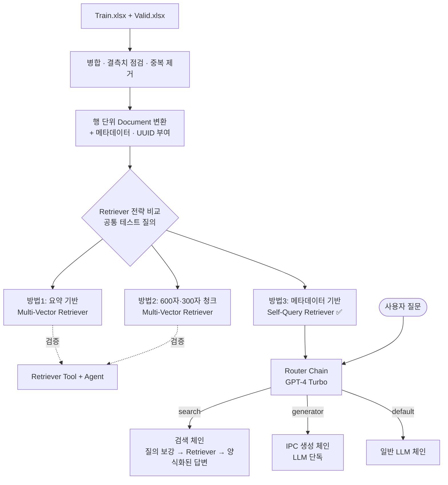

# 특허 정보 검색 · IPC 코드 생성 RAG 시스템

> **DS학술제 모델링 경진대회(2024.11) 장려상** · 팀 프로젝트
> LangChain 기반 RAG(Retrieval-Augmented Generation)로 **특허 데이터 검색**과 **IPC(국제특허분류) 코드 자동 생성**을 하나의 질의 인터페이스에서 처리하는 시스템

<p>
  
  
  
  
  
</p>

## 1. 프로젝트 개요

| 항목 | 내용 |
|---|---|
| 프로젝트명 | 특허 정보 검색 · IPC 코드 생성 RAG 시스템 |
| 개발 기간 | 2024.09 ~ 2024.11 (저장소 커밋 날짜는 이후 업로드 시점) |
| 참여 인원 | 2인 팀 |
| 나의 역할<br>&nbsp;&nbsp;&nbsp;&nbsp;&nbsp;&nbsp;&nbsp;&nbsp;&nbsp;&nbsp;&nbsp;&nbsp;&nbsp;&nbsp;&nbsp;&nbsp;&nbsp;&nbsp;&nbsp; | **검색 · 생성 로직 코드 전체** — Retriever 3종 설계 · 구현, Self-Query 메타데이터 설계, LLM 라우터 체인 |
| 팀원 역할 | 데이터 라벨링 · 데이터 이해(파악) |
| 수상 | 강남대학교 데이터사이언스전공 학술제(DS학술제 모델링 경진대회) 장려상, 2024.11 |

특허 문서에는 발명의 명칭 · 요약 · 대표청구항 같은 긴 글과, 출원번호 · 전체 IPC · 출원인 · 법적상태처럼 정확히 맞아야 하는 값이 섞여 있습니다. 벡터 유사도 검색만으로는 `G16H-010/60,[G06Q-010/10, ...]` 같은 코드를 정확히 찾기 어려웠습니다. 그래서 특허 3,006건(22개 컬럼)을 벡터DB에 넣고, 질문 의도에 따라 **기존 특허 조회**와 **새 발명의 IPC 코드 생성**을 하나의 질의 함수로 처리하도록 만들었습니다.

> 이 저장소의 노트북(`RAG_Modeling.ipynb`)은 본인이 담당한 RAG 파이프라인 부분이며, 출력은 지운 상태입니다.

## 2. 기술 스택

| 구분 | 기술 |
|---|---|
| 사용 언어 | Python |
| 프레임워크 | LangChain 0.3 (LCEL, Agents, Retrievers, `RunnableBranch`), pandas · openpyxl |
| 데이터베이스 | ChromaDB(디스크 영구 저장), `LocalFileStore`(Multi-Vector 원문 저장소) |
| 개발 도구<br>&nbsp;&nbsp;&nbsp;&nbsp;&nbsp;&nbsp;&nbsp;&nbsp;&nbsp;&nbsp;&nbsp;&nbsp;&nbsp;&nbsp;&nbsp;&nbsp;&nbsp;&nbsp;&nbsp;&nbsp;&nbsp;&nbsp;&nbsp; | Google Colab + Google Drive, OpenAI `gpt-4-turbo-preview`(Agent · Self-Query · Router · 생성) · `gpt-4o-mini`(문서 요약), 임베딩 `jhgan/ko-sroberta-multitask` |

## 3. 시스템 구조


```mermaid
flowchart TD
    A[Train.xlsx + Valid.xlsx] --> B[병합 · 결측치 점검 · 중복 제거]
    B --> C[행 단위 Document 변환<br/>+ 메타데이터 · UUID 부여]
    C --> D{Retriever 전략 비교<br/>공통 테스트 질의}

    D --> E1[방법1: 요약 기반<br/>Multi-Vector Retriever]
    D --> E2[방법2: 600자·300자 청크<br/>Multi-Vector Retriever]
    D --> E3[방법3: 메타데이터 기반<br/>Self-Query Retriever ✅]

    E1 -.검증.-> AG[Retriever Tool + Agent]
    E2 -.검증.-> AG

    E3 --> F[Router Chain<br/>GPT-4 Turbo]
    U([사용자 질문]) --> F
    F -->|search| G[검색 체인<br/>질의 보강 → Retriever → 양식화된 답변]
    F -->|generator| H[IPC 생성 체인<br/>LLM 단독]
    F -->|default| I[일반 LLM 체인]
```

Retriever 3종을 같은 질의로 비교한 뒤, 정확 일치 조건을 메타데이터 필터로 처리할 수 있는 Self-Query Retriever에 라우터 체인을 붙였습니다. 라우터가 질문을 검색 · 생성 · 일반 답변 중 하나로 분기합니다.

## 4. 주요 기능

### 핵심 기능

- **특허 검색**: IPC 코드 · 출원번호 · 출원인 같은 정확 일치 조건과 발명 내용의 의미 검색을 함께 처리하고, 출원번호 · 메인IPC · 전체IPC · 요약정보 · 법적상태 · 등록번호 · 출원인을 정해진 양식으로 답합니다.
- **IPC 코드 생성**: 발명 내용을 받으면 LLM이 최대 10개의 IPC 코드를 중요도 순으로 만들고, 코드마다 한글 분류명과 부여 사유를 붙입니다.
- **의도 분기**: LLM 라우터가 질문을 `search` · `generator` · `default`로 나눠 해당 체인으로 보냅니다.

### 기술적 차별점

- **정확 일치 값은 메타데이터 필터로**: 8개 필드(`doc_id` + 메타 7개)를 metadata로 두고 `AttributeInfo`로 뜻을 설명해, LLM이 질문을 "의미 검색어 + 필터"로 나누게 했습니다.
- **청크에도 문서 식별 정보를 남김**: 청크마다 IPC · 출원번호 메타 문자열을 붙이고 UUID(`doc_id`)로 원문과 연결해, 어느 조각이 검색되든 원문 전체를 돌려줍니다.
- **정해진 경로로 분기**: Agent 대신 `RunnableBranch` 라우터 체인으로, 같은 종류의 질문은 늘 같은 체인을 탑니다.

### 비용 · 시간 절감

- 문서 요약은 `batch(max_concurrency=5)`로 병렬 처리하고, 결과를 `list.pickle`에 캐싱해 API를 다시 호출하지 않습니다.
- 방법별 벡터DB를 Google Drive에 따로 저장해 두고, 저장본이 있으면 문서 가공 · 요약 · 저장 셀("SKIP" 표시)을 건너뛰고 불러오기만 합니다.

## 5. 문제 해결 사례

### 검색 — IPC 코드처럼 정확히 일치해야 하는 값을 임베딩 유사도로 못 찾던 문제

**직면한 문제**
전체 IPC가 `G16H-010/60,[G06Q-010/10, G16H-010/20, G16H-080/00]`와 정확히 일치하는 특허를 찾아야 했는데, 임베딩 유사도는 비슷한 문서를 찾을 뿐 코드가 정확히 같은지는 보장하지 못합니다. 방법 1 · 2는 벡터 텍스트에 메타 필드를 붙였지만 metadata에는 4개 필드만 두어, 긴 코드 문자열도 유사도로만 찾아야 했습니다.

**해결 과정**
Retriever 3종(요약 기반 Multi-Vector, 600자 · 300자 청크 Multi-Vector, Self-Query)을 직접 구현하고, 같은 테스트 질의 세트(IPC 정확 일치, 긴 IPC 조회, 발명 설명문, 메타 조건, 주제 검색)로 반환 문서를 비교했습니다. 비교는 혼자 했고, 결과를 팀원과 함께 보고 8개 필드를 모두 필터로 쓸 수 있는 Self-Query Retriever를 골랐습니다. `ParentDocumentRetriever`는 청크에 메타 문자열을 직접 붙이려고 쓰지 않고 `MultiVectorRetriever`로 직접 구성했습니다.

**결과 및 학습점**
긴 IPC 코드 문자열을 LLM이 메타데이터 필터로 바꿔, 질문과 전체 IPC가 정확히 일치하는 문서를 찾았습니다(6절 ①). 이 비교는 반환 문서를 직접 확인한 정성 비교이고 정량 지표는 쓰지 않았습니다. 정확 일치 조건은 검색 문제가 아니라 필터 문제로 바꿔야 한다는 것을 배웠습니다.

핵심 코드: `RAG_Modeling.ipynb` Ⅳ. 방법3 — `SelfQueryRetriever.from_llm(..., metadata_field_info=metadata_field_info)`

### 체인 설계 — Agent의 조회 · 생성 경로가 일정하지 않던 문제

**직면한 문제**
처음에는 각 Retriever를 Tool로 감싼 OpenAI Functions Agent로 질의했는데, 도구를 쓸지와 순서를 LLM이 정해 같은 종류의 질문에도 조회로 갈 때와 생성으로 갈 때가 달랐습니다.

**해결 과정**
먼저 도구 설명과 시스템 프롬프트를 2차에 걸쳐 고쳤습니다(IPC가 있으면 전체 IPC 정확 일치로 검색 · 없으면 유사 특허 검색 · 정보가 없으면 생성). 그래도 경로를 LLM이 고르는 구조는 그대로라서, 최종 단계에서는 LCEL의 `RunnableBranch`로 라우터가 고른 이름대로 체인을 나누게 바꿨습니다. 라우터 결과만 뽑는 체인을 따로 만들어 모호한 질의가 어디로 분류되는지 먼저 확인했습니다.

**결과 및 학습점**
질문은 검색 · 생성 · 일반 답변 중 하나의 체인으로 분기되고, 체인마다 출력 양식이 고정됩니다. 추출하지 못한 항목은 `검색불가`로 표시하게 했습니다. 경로가 중요한 흐름은 LLM의 판단에 맡기기보다 코드로 분기하는 편이 안정적이라는 것을 배웠습니다.

핵심 코드: `RAG_Modeling.ipynb` 라. Chain 생성 및 실행 — `RunnableBranch`, `question()`

## 6. 실행 결과

원본 실행 로그에서 발췌했습니다. 출원번호 · 등록번호 · 출원인은 가렸고, 대회 데이터는 저장소에 넣지 않았습니다.

| 질의 | 경로 | 결과 |
|---|---|---|
| ① 전체 IPC가 `G16H-010/60,[G06Q-010/10, G16H-010/20, G16H-080/00]`와 정확히 일치하는 특허 | Self-Query Retriever 단독<br>&nbsp;&nbsp;&nbsp;&nbsp;&nbsp;&nbsp;&nbsp;&nbsp;&nbsp;&nbsp;&nbsp;&nbsp;&nbsp;&nbsp;&nbsp;&nbsp;&nbsp;&nbsp;&nbsp;&nbsp;&nbsp;&nbsp;&nbsp;&nbsp;&nbsp;&nbsp;&nbsp;&nbsp;&nbsp;&nbsp;&nbsp;&nbsp;&nbsp;&nbsp;&nbsp;&nbsp;&nbsp;&nbsp;&nbsp;&nbsp;&nbsp;&nbsp;&nbsp;&nbsp;&nbsp;&nbsp;&nbsp; | 전체 IPC가 질문과 정확히 일치하는 특허(병원 고객관리 시스템) 반환 |
| ② "기능성위장관질환의 증상 조절을 위한 자가완성형 음식 조절 서비스…"와 관련한 특허 | 최종 체인 → search | 식이 · 건강관리 분야 특허 4건 반환, 모두 `G16H-020/60` 계열 |
| ③ 출원인이 '○○○ 주식회사'인 특허 3개 | 최종 체인 → search | 출원인 조건에 맞는 특허를 양식대로 반환 |
| ④ 음식 조절 가이드라인 발명 설명의 IPC 생성 | 최종 체인 → generator | `G16H 50/20`(개인화된 건강 데이터 관리) · `G06Q 50/22`(건강관리 서비스) 등을 부여 사유와 함께 생성 |

## 7. 실행 방법

1. Google Colab에서 `RAG_Modeling.ipynb`를 열고, Drive 작업 경로(`/content/drive/MyDrive/Colab Notebooks/testdata/contest/`)에 대회 데이터(Train · Valid 엑셀)를 넣습니다.
2. 노트북의 `pip install -U` 셀 대신 `pip install -r requirements.txt`를 실행합니다(LangChain 1.0에서 제거된 API를 써서 0.3.x로 고정).
3. Colab 보안 비밀(🔑)에 `OPENAI_API_KEY`를 등록합니다. Colab 밖에서는 `.env.example`을 `.env`로 복사해 채웁니다.
4. Ⅰ(데이터 정제) · Ⅲ(벡터 환경 구성)을 실행하고, 최종 체인이 쓰는 방법3은 반드시 실행한 뒤 `question("질문")`으로 질의합니다. 저장된 벡터DB · `list.pickle`이 있으면 생성 셀을 건너뛰고 불러옵니다.

## 8. 프로젝트 구조 · 보안

```
Patent_Classification/
├── RAG_Modeling.ipynb      # 전처리 → 벡터DB → Retriever → Agent/Chain, 출력 제거본
├── requirements.txt        # 의존성 목록 (LangChain 0.3.x 고정)
├── .env.example            # 환경변수 템플릿
├── .githooks/pre-commit    # 커밋 전 API 키 유출 검사
└── README.md
```

- `.env`, 대회 데이터(`data/`, `*.xlsx`), 벡터DB(`store/`), 요약 캐시(`*.pickle`)는 `.gitignore`로 제외됩니다.
- 클론 후 `git config core.hooksPath .githooks`를 실행하면 커밋할 때 API 키 패턴과 `.env` 파일을 검사합니다.
