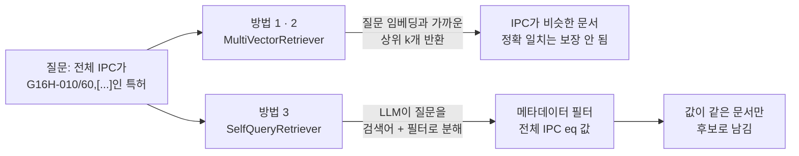
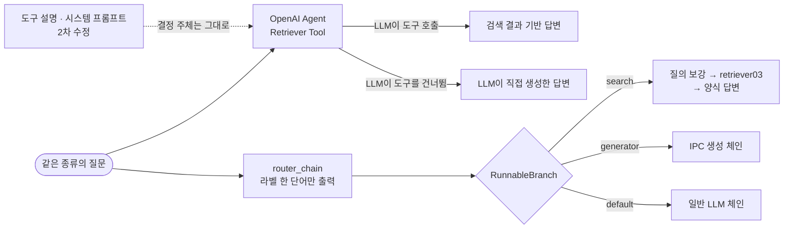
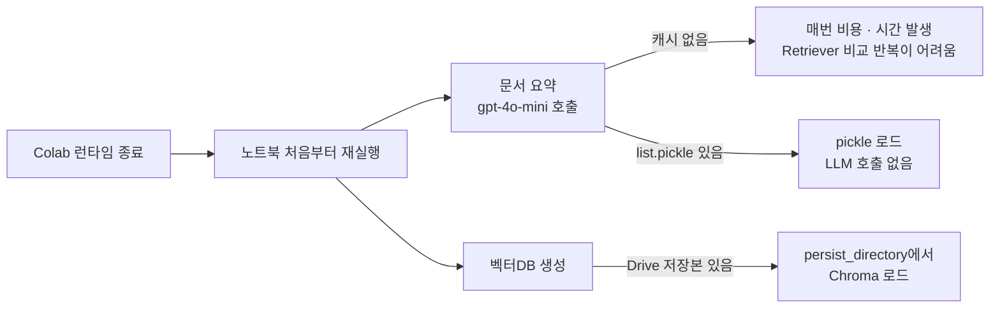

# 특허 검색 · IPC 코드 생성 RAG 시스템

특허 3,006건을 벡터DB에 넣고, 질문 의도에 따라 기존 특허 조회와 새 발명의 IPC 코드 생성을 하나의 질의 함수로 처리하는 시스템입니다.

<p>
  
  
  
  
  
</p>

특허 문서에는 성격이 다른 두 종류의 값이 섞여 있습니다. 발명의 명칭이나 요약, 대표청구항은 긴 글이라 의미로 찾아야 합니다. 반면 출원번호와 전체 IPC, 출원인, 법적상태는 글자 단위로 정확히 맞아야 합니다. 이 시스템은 두 조건을 나눠 입력하지 않아도 한 질의에서 처리합니다. 여기에 아직 출원하지 않은 발명의 설명을 넣으면 IPC 코드를 만들어 주는 경로를 붙였습니다.

## 개요

| 항목 | 내용 |
| --- | --- |
| 기간 | 2024.09 ~ 2024.11 |
| 인원과 본인 역할 | 2인 팀. 본인은 검색과 생성 로직 코드 전체를 맡았고, 팀원은 데이터 라벨링과 데이터 파악을 맡았습니다 |
| 상태 | 완료 (Colab 노트북 1개, 출력 제거본) |
| 수상 | 강남대학교 데이터사이언스전공 DS학술제 모델링 경진대회 장려상 (2024.11) |
| 핵심 기술 | LangChain 0.3 (`SelfQueryRetriever` · `MultiVectorRetriever` · LCEL `RunnableBranch`), ChromaDB, `jhgan/ko-sroberta-multitask`, OpenAI `gpt-4-turbo-preview` · `gpt-4o-mini` |

## 문제 해결 사례

1. [IPC 코드처럼 정확히 일치해야 하는 값을 임베딩 유사도로 못 찾던 문제를 메타데이터 필터로 해결](#ipc-코드처럼-정확히-일치해야-하는-값을-임베딩-유사도로-못-찾던-문제를-메타데이터-필터로-해결)
2. [Agent가 조회와 생성 경로를 일정하게 고르지 못하던 문제를 라우터 체인으로 해결](#agent가-조회와-생성-경로를-일정하게-고르지-못하던-문제를-라우터-체인으로-해결)
3. [재실행마다 요약 API를 다시 부르던 문제를 캐싱으로 해결](#재실행마다-요약-api를-다시-부르던-문제를-캐싱으로-해결)

### IPC 코드처럼 정확히 일치해야 하는 값을 임베딩 유사도로 못 찾던 문제를 메타데이터 필터로 해결

**문제 흐름**


```mermaid
flowchart LR
  Q["질문: 전체 IPC가<br/>G16H-010/60,[...]인 특허"] --> M12["방법 1 · 2<br/>MultiVectorRetriever"]
  M12 -->|"질문 임베딩과 가까운<br/>상위 k개 반환"| X["IPC가 비슷한 문서<br/>정확 일치는 보장 안 됨"]
  Q --> M3["방법 3<br/>SelfQueryRetriever"]
  M3 -->|"LLM이 질문을<br/>검색어 + 필터로 분해"| F["메타데이터 필터<br/>전체 IPC eq 값"]
  F --> O["값이 같은 문서만<br/>후보로 남김"]
```

**문제 원인**

경진대회 과제에는 "전체 IPC가 `G16H-010/60,[G06Q-010/10, G16H-010/20, G16H-080/00]`와 정확히 일치하는 특허"를 찾는 질의가 있었습니다. 전체 IPC는 메인 코드 하나와 부가 코드 목록을 이어 붙인 긴 문자열입니다. 이 값이 한 글자라도 다르면 다른 특허입니다.

처음 구현한 방법 1과 2는 둘 다 `MultiVectorRetriever` 기반의 임베딩 유사도 검색이었습니다.

- 방법 1: 특허 한 건을 `gpt-4o-mini`로 세 문장 요약하고, 요약문 뒤에 `메인IPC2` · `전체 IPC` · 출원번호 같은 메타 필드를 문자열로 붙여 임베딩했습니다.
- 방법 2: 원문을 600자와 300자 청크로 두 번 나누고, 청크마다 같은 메타 문자열을 붙여 임베딩했습니다.

두 방법 모두 검색된 조각의 `doc_id`(UUID)로 원문 전체를 `LocalFileStore`에서 꺼내 돌려줍니다. 그래서 어느 조각이 걸리든 특허 한 건 전체를 받습니다. `ParentDocumentRetriever`는 청크 분할을 내부에서 처리해 청크 본문에 메타 문자열을 직접 붙이기 어려웠습니다. 그래서 `MultiVectorRetriever`로 부모와 자식 문서를 직접 구성했습니다.

같은 IPC 질의를 두 Retriever에 넣어 보니 비슷한 문서는 나왔지만 전체 IPC가 질문과 같은지는 보장되지 않았습니다. 임베딩 텍스트에 IPC 문자열을 붙여 둔 것은 이 값이 유사도에 반영되길 기대해서였습니다. 하지만 이 기대는 세 가지 이유로 맞지 않았습니다.

- **코드 문자열은 벡터 하나에서 작은 비중만 차지합니다.** 임베딩 대상은 요약문이나 청크 본문이고 IPC는 그 뒤에 붙은 일부입니다. 문장 단위 의미를 학습한 `ko-sroberta-multitask`에게 `G16H-010/60`과 `G16H-010/20`은 거의 같은 토큰열이라, 숫자 몇 자리 차이가 벡터 거리에 뚜렷하게 드러나기 어렵습니다.
- **유사도 검색에는 "일치하는 문서 없음"이라는 결과가 없습니다.** 벡터 검색은 질문과 가장 가까운 k개를 항상 돌려줍니다. 정확히 같은 코드를 가진 문서가 있든 없든 비슷한 문서로 결과가 채워집니다.
- **방법 1 · 2에는 필터를 거는 단계 자체가 없었습니다.** 메타데이터에 `doc_id` · `메인IPC2` · `전체 IPC` · 출원번호 4개 필드를 두긴 했지만 검색할 때 필터를 넘기지 않아서 벡터 유사도만으로 후보가 정해졌습니다.

**해결 과정**

방법 3에서는 임베딩을 맞추는 대신 정확 일치 조건을 메타데이터 필터로 넘겼습니다. 특허 한 행의 22개 컬럼 전체를 문서 본문으로 쓰고, 8개 필드(`doc_id` · `메인IPC2` · `전체 IPC` · 출원번호 · 등록번호 · 출원인 · 발명자 · 법적상태)를 모두 metadata에 넣었습니다. 그 위에 `SelfQueryRetriever`를 올렸습니다.

`SelfQueryRetriever`는 질문을 받으면 LLM에게 문서 설명과 필드 목록을 주고, 질문을 "의미 검색어"와 "구조화된 필터"로 나누게 합니다. LLM이 쓴 필터 식은 `lark` 파서로 해석된 뒤 Chroma의 `where` 조건으로 바뀝니다. 그래서 LLM이 IPC 질의에서 `전체 IPC` 필터를 만들면, 값이 같은 문서만 후보로 남고 그 안에서만 유사도 순위를 매깁니다.

LLM이 필터를 제대로 만들려면 필드의 뜻을 알아야 합니다. `AttributeInfo`에 필드마다 설명을 쓰고, IPC가 들어온 질문이면 `전체 IPC` 필드로 정확 일치 필터를 만들라고 적었습니다.

```python
AttributeInfo(
    name="전체 IPC",
    description="특허의 요약내용을 토대로 이 특허에 해당하는 IPC 전체 값을 가지고 있다.\
    사용자 요청이 IPC를 포함하고 있을 때는 반드시 '전체 IPC'를 이용하여 정확히 일치하는 데이터를 먼저 검색하고 \
    그 다음에 메인IPC2를 검색한다.",
    type="string",
),
# ... doc_id, 메인IPC2, 출원번호, 등록번호, 출원인, 발명자, 법적상태

retriever03 = SelfQueryRetriever.from_llm(
    llm=llm,  # gpt-4-turbo-preview, temperature=0
    vectorstore=vectorstore03,
    metadata_field_info=metadata_field_info,
    document_contents="특허 정보를 가지고 있다",
)
```

이 방식에도 한계는 있습니다. 필터는 저장된 문자열과 글자 단위로 비교하므로, 공백이나 괄호를 다르게 쓴 IPC는 일치하지 않습니다. 테스트 질의는 대회 데이터의 IPC 표기를 그대로 옮겨 썼기 때문에 이 제약이 드러나지 않았습니다. 실제 사용자 입력을 받으려면 IPC 표기를 정규화하는 단계가 필요합니다.

핵심 코드: `RAG_Modeling.ipynb` Ⅳ-3 "메타정보를 이용하여 Retriever 생성"

**테스트**

- Colab에서 같은 테스트 질의 세트를 세 Retriever에 넣고 반환 문서를 직접 확인했습니다.
- 질의 세트는 다섯 유형으로 구성했습니다. 전체 IPC 정확 일치, 부가 코드가 긴 IPC 조회, 발명 설명문으로 관련 특허 찾기, 메타 조건(`메인IPC2`가 G06Q인 특허), 주제 검색(인공지능 관련 특허)입니다.
- 비교 실험은 혼자 진행했습니다. 방법 3은 그 결과를 팀원과 함께 검토해 골랐습니다.

**결과** 테스트 질의의 긴 IPC 문자열이 메타데이터 필터로 바뀌었고 전체 IPC가 정확히 일치하는 특허가 반환됐습니다.

**배운 점** IPC처럼 정확히 같아야 하는 값은 임베딩 텍스트에 붙여 두어도 검색 결과에서 보장되지 않았습니다. 이런 값은 메타데이터 필터로 넘겨야 합니다. 방법을 고를 때는 같은 질의로 실제 반환 결과를 비교해 봐야 한다는 것도 배웠습니다.

### Agent가 조회와 생성 경로를 일정하게 고르지 못하던 문제를 라우터 체인으로 해결

**문제 흐름**


```mermaid
flowchart LR
  Q(["같은 종류의 질문"]) --> AG["OpenAI Agent<br/>Retriever Tool"]
  AG -->|"LLM이 도구 호출"| T["검색 결과 기반 답변"]
  AG -->|"LLM이 도구를 건너뜀"| G["LLM이 직접 생성한 답변"]
  P["도구 설명 · 시스템 프롬프트<br/>2차 수정"] -.->|"결정 주체는 그대로"| AG
  Q --> R["router_chain<br/>라벨 한 단어만 출력"]
  R --> B{"RunnableBranch"}
  B -->|search| S["질의 보강 → retriever03<br/>→ 양식 답변"]
  B -->|generator| GN["IPC 생성 체인"]
  B -->|default| D["일반 LLM 체인"]
```

**문제 원인**

처음에는 방법 1 · 2의 Retriever를 `create_retriever_tool`로 감싸 OpenAI Functions Agent에 넘겼습니다. 사용자가 질문하면 Agent가 Tool을 부를지 판단하고, 부른다면 결과를 받아 답을 씁니다.

그런데 같은 종류의 질문에도 Retriever를 거쳐 조회로 답할 때와 Tool 없이 LLM이 직접 답을 만들어 낼 때가 섞였습니다. 특허 조회에서는 이 차이가 큰 문제입니다. 조회 경로는 실제 데이터에 있는 출원번호와 IPC를 돌려주지만, 생성 경로는 그럴듯한 값을 지어낼 수 있기 때문입니다.

처음에는 프롬프트가 모호해서라고 보고 두 차례 고쳤습니다.

1. 1차: Tool 설명에 "질문에 IPC가 있으면 답변에도 같은 IPC가 포함되어야 한다"는 조건을 넣고, 시스템 메시지에 "IPC가 있으면 IPC 문자열로 검색하라"를 추가했습니다.
2. 2차: `create_openai_tools_agent`로 바꾸고 시스템 프롬프트에 규칙 세 개를 적었습니다. IPC가 있으면 전체 IPC 정확 일치 검색, 없으면 유사 특허 검색, 정보가 없으면 직접 생성입니다.

두 번 고친 뒤에도 경로가 흔들렸습니다. 다시 살펴보니 문구를 고쳐서는 바뀌지 않는 부분이 있었습니다. Agent 방식에서는 Tool을 부를지를 매 질문마다 LLM이 정합니다. 게다가 프롬프트가 "정보가 없으면 직접 생성"이라는 탈출구를 열어 두고 있었습니다. 1차 Tool 설명에도 "여기에 없는 특허 질문이면 LLM을 통해 검색한다"는 문장이 있었습니다. 프롬프트를 고쳐도 조회와 생성 중 무엇을 고를지는 여전히 LLM이 정했습니다.

**해결 과정**

LLM의 역할을 "어느 경로인가"를 라벨 하나로 답하는 분류로 줄였습니다. 경로를 실제로 실행하는 일은 코드가 맡게 했습니다. LCEL로 라우터 체인과 `RunnableBranch`를 구성했습니다.

- `router_chain`은 질문과 카테고리 설명(`search`: 기존 정보 조회, `generator`: 새로운 정보 생성)을 받아 한 단어만 출력합니다. 맞는 카테고리가 없으면 `default`를 냅니다.
- `RunnableBranch`는 이 라벨을 보고 체인을 고릅니다. 라벨 비교는 소문자로 바꾼 뒤 부분 문자열로 확인합니다. 그래서 LLM이 `Search`나 `search.`처럼 대소문자나 문장부호를 섞어 내도 같은 분기로 갑니다.
- `search` 체인은 질문 뒤에 "단, 가장 일치하는 정보를 검색해 주세요"를 붙여 `retriever03`(Self-Query)에 넘깁니다. 검색 호출은 체인에 고정돼 있어 건너뛸 수 없습니다. 결과는 출원번호 · 메인IPC · 전체IPC · 요약정보 · 법적상태 · 등록번호 · 출원인 양식으로 답하고, 추출하지 못한 항목은 `검색불가`로 표시합니다.
- `generator` 체인은 검색 없이 LLM만으로 IPC 코드를 최대 10개 만들고, 코드마다 한글 분류명과 부여 사유를 함께 출력합니다.

```python
router_chain = {"input": itemgetter("input")} | router_prompt | llm | StrOutputParser()

branch = RunnableBranch(
    (lambda x: "search" in x['destination'].lower(), destination_chains['search']),
    (lambda x: "generator" in x['destination'].lower(), destination_chains['generator']),
    default_chain,
)

final_chain = {"input": itemgetter("input"), "destination": router_chain} | branch
```

Agent 방식과 비교하면 LLM이 맡는 결정의 범위가 줄었습니다. Agent에서는 LLM이 "Tool을 부를지"를 매번 정했고, 부르지 않는 선택도 늘 열려 있었습니다. 라우터 체인에서도 분류는 여전히 LLM이 합니다. 하지만 `search`로 분류되면 Retriever 호출은 코드로 고정되므로 검색을 건너뛸 수 있는 경로가 사라졌습니다. 다만 search 프롬프트에 "제공되는 정보가 없으면 생성한다"는 문장이 남아 있어, 검색 결과가 0건이면 이 체인도 값을 지어낼 수 있습니다.

본 체인에 붙이기 전에 라우터 결과만 반환하는 `router01_chain`을 따로 만들었습니다. 이 체인으로 "정보를 찾아주세요"처럼 모호한 질의가 어디로 분류되는지 먼저 확인했습니다.

핵심 코드: `RAG_Modeling.ipynb` Ⅳ "라. Chain 생성 및 실행" (`router_chain`, `RunnableBranch`, `question()`)

**테스트**

- Colab에서 `router01_chain`에 모호한 질의를 넣어 분류 결과를 먼저 확인했습니다.
- 최종 체인에 네 가지 질의를 넣어 의도한 체인으로 가는지와 출력 양식이 지켜지는지 확인했습니다. 발명 설명문으로 관련 특허 조회, 전체 IPC 조회, 출원인 조건 조회, 발명 설명으로 IPC 생성입니다.

**결과** 조회 질문은 `search`로 가서 항상 Retriever를 거치고 생성 요청은 `generator`로 갑니다. search와 generator 체인은 프롬프트로 출력 양식을 지정했습니다.

**배운 점** 프롬프트로 경로를 지시하는 것만으로는 Agent가 검색을 건너뛰는 일을 막지 못했습니다. LLM에게서 라벨만 받고 실행은 코드로 나누자 검색 경로가 고정됐습니다. 다만 프롬프트 안에 남은 "없으면 생성" 같은 문장은 코드 분기와 별도로 지워야 한다는 것도 확인했습니다.

### 재실행마다 요약 API를 다시 부르던 문제를 캐싱으로 해결

**문제 흐름**


```mermaid
flowchart LR
  C["Colab 런타임 종료"] --> R["노트북 처음부터 재실행"]
  R --> S["문서 요약<br/>gpt-4o-mini 호출"]
  S -->|"캐시 없음"| X["매번 비용 · 시간 발생<br/>Retriever 비교 반복이 어려움"]
  S -->|"list.pickle 있음"| K["pickle 로드<br/>LLM 호출 없음"]
  R --> V["벡터DB 생성"]
  V -->|"Drive 저장본 있음"| D["persist_directory에서<br/>Chroma 로드"]
```

**문제 원인**

개발 환경은 Google Colab이었습니다. Colab은 런타임이 끊기면 메모리에 있던 변수와 객체가 모두 사라집니다. 이 노트북에서 가장 비싼 단계는 방법 1의 문서 요약이었습니다. 특허마다 `gpt-4o-mini`를 한 번씩 호출하기 때문에, 처음부터 다시 돌릴 때마다 전체 건수만큼 API 비용과 대기 시간이 들었습니다.

이 비용은 실험 횟수와 바로 연결됐습니다. Retriever 3종을 비교하려면 같은 데이터로 질의를 여러 번 돌려 봐야 합니다. 그런데 재실행할 때마다 요약과 벡터DB 적재를 다시 해야 했습니다. 적재 셀은 다시 실행하면 Chroma 컬렉션에 같은 문서가 한 번 더 추가되므로, 저장본이 있을 때 건너뛸 방법도 필요했습니다.

**해결 과정**

비싼 중간 산출물을 Google Drive에 저장하고, 다음 실행에서는 불러오기만 하도록 노트북을 나눴습니다.

- **요약 결과 캐싱**: 요약 체인을 `batch(docs, {"max_concurrency": 5})`로 병렬 실행했습니다. 동시에 최대 5건까지 요약을 요청합니다. 끝나면 `len(docs)`와 `len(summaries)`가 같은지 확인한 뒤, 요약 리스트를 Drive 작업 폴더의 `list.pickle`에 저장했습니다. 다음 실행부터는 이 파일만 읽습니다.
- **벡터DB 영구 저장**: 방법마다 Chroma의 `persist_directory`(`./store/summarise/`, `./store/samllize/`(노트북 원문 표기), `./store/meta/`)와 컬렉션 이름을 따로 두었습니다. Multi-Vector 원문 저장소도 `LocalFileStore`로 디스크에 남겼습니다. 같은 경로로 `Chroma`를 다시 만들면 저장된 컬렉션을 그대로 읽어 옵니다.
- **SKIP 구간 표시**: 문서 가공 · 요약 · 적재 셀의 제목에 "벡터DB가 저장되어 있다면 SKIP"을 적어, 저장본이 있으면 이 셀들을 건너뛰고 불러오기 셀만 실행하게 했습니다. 컬렉션을 처음부터 다시 만들 때만 쓰는 `delete_collection()` 셀은 주석으로 따로 두었습니다.

```python
summaries = chain.batch(docs, {"max_concurrency": 5})

with open("list.pickle", "wb") as f:
    pickle.dump(summaries, f)

# 다음 실행부터는 요약 대신 이 셀만 실행
with open("list.pickle", "rb") as f:
    summaries = pickle.load(f)
```

다만 이 캐시는 언제 다시 만들어야 하는지 스스로 알지 못해서 한계가 두 가지 있습니다.

- 캐시 키가 따로 없습니다. 요약 리스트는 문서 순서대로 저장되고, 불러온 뒤 `summaries[i]`를 `doc_ids[i]`와 짝지어 쓰는 위치 기반 방식입니다. 그래서 원본 엑셀의 행 순서나 중복 제거 결과가 바뀌면 캐시를 다시 만들어야 합니다.
- 저장본이 있는지 확인하고 셀을 건너뛰는 일은 사람이 직접 합니다.

핵심 코드: `RAG_Modeling.ipynb` Ⅲ "벡터 환경 구성", Ⅳ-1 "나. 요약정보 생성작업" · "다. 이미 요약자료를 생성해서 이미 저장한 경우 이를 읽어 온다"

**테스트**

- 요약 직후와 pickle을 불러온 뒤 각각 `len(summaries)`를 출력해 문서 수와 맞는지 확인했습니다.
- 저장된 경로로 벡터DB를 다시 연결한 상태에서 Retriever 질의를 이어서 실행했습니다.

**결과** 재실행할 때 요약 API를 다시 부르지 않고, 저장된 벡터DB로 Retriever 비교 실험을 이어갈 수 있게 됐습니다.

**배운 점** LLM 요약은 다시 돌리면 내용이 달라질 수 있습니다. 한 번 만든 요약을 저장해 쓰면 비용이 줄고 Retriever 비교 조건도 같게 유지됩니다.

## 아키텍처


```mermaid
flowchart TD
    A[Train.xlsx + Valid.xlsx] --> B[병합 · 결측치 점검 · 중복 제거]
    B --> C[행 단위 Document 변환<br/>메타데이터 8개 · UUID 부여]
    C --> D{Retriever 전략 비교<br/>공통 테스트 질의}

    D --> E1[방법1 요약 기반<br/>Multi-Vector]
    D --> E2[방법2 600자·300자 청크<br/>Multi-Vector]
    D --> E3[방법3 메타데이터 기반<br/>Self-Query · 채택]

    E1 -.->|검증| AG[Retriever Tool + Agent]
    E2 -.->|검증| AG

    E3 --> F[Router Chain<br/>GPT-4 Turbo]
    U([사용자 질문]) --> F
    F -->|search| G[검색 체인<br/>질의 보강 → Retriever → 양식화된 답변]
    F -->|generator| H[IPC 생성 체인<br/>LLM 단독]
    F -->|default| I[일반 LLM 체인]
```

라우터가 질문을 `search` · `generator` · `default` 중 하나로 분류하면, 코드가 그 이름대로 체인을 나눕니다. 검색 체인은 Self-Query Retriever로 문서를 찾고, 생성 체인은 검색 없이 LLM이 IPC 코드와 부여 사유를 만듭니다.

## 기술 스택

| 구분 | 기술 | 선택한 이유 |
| --- | --- | --- |
| 언어 · 데이터 | Python, pandas, openpyxl | 대회 데이터가 엑셀 형식이었습니다 |
| 프레임워크 | LangChain 0.3 (LCEL, Agents, Retrievers, `RunnableBranch`) | Retriever 여러 종을 같은 인터페이스로 바꿔 끼우며 비교하려고 썼습니다 |
| 벡터 저장 | ChromaDB (디스크 영구 저장), `LocalFileStore` | Colab 런타임이 끊겨도 Drive에 남은 벡터DB를 다시 불러 쓰려고 썼습니다 |
| 모델 | OpenAI `gpt-4-turbo-preview` (Agent · Self-Query · Router · 생성), `gpt-4o-mini` (문서 요약) | 요약은 건수가 많아 저렴한 모델로, 질의 분해와 생성은 상위 모델로 나눴습니다 |
| 임베딩 | `jhgan/ko-sroberta-multitask` | 특허 원문이 한국어라 한국어 문장 임베딩을 썼습니다 |
| 환경 | Google Colab + Google Drive | |

## 역할과 기여도

2인 팀에서 검색과 생성 로직 코드 전체를 담당했습니다. 데이터 라벨링과 데이터 파악은 팀원이 맡았습니다.

- 특허 3,006건(22개 컬럼)을 행 단위 Document로 바꾸고, 메타데이터 8개 필드와 UUID를 설계했습니다.
- Retriever 3종을 직접 구현하고 같은 테스트 질의 세트로 비교해 방식을 정했습니다.
- `AttributeInfo`로 각 필드의 뜻을 기술해 LLM이 질문을 의미 검색어와 필터로 분해하게 했습니다.
- 방법 1 · 2에서는 청크마다 IPC · 출원번호 메타 문자열을 붙이고 UUID로 원문과 연결했습니다. 어느 조각이 검색되든 원문 전체를 돌려주도록 `MultiVectorRetriever`를 직접 구성했습니다.
- Agent를 `RunnableBranch` 라우터 체인으로 바꿔, 조회로 분류된 질문은 반드시 Retriever를 거치게 했습니다.
- IPC 생성 체인이 코드마다 한글 분류명과 부여 사유를 함께 내도록 프롬프트에 출력 양식을 지정했습니다.
- 요약 병렬 처리와 pickle 캐싱, 방법별 벡터DB의 Drive 영구 저장으로 재실행 때 요약 API 호출을 없앴습니다.

## 결과

원본 실행 로그에서 발췌했습니다. 출원번호 · 등록번호 · 출원인은 가렸고, 대회 데이터는 저장소에 넣지 않았습니다.

| 질의 | 경로 | 결과 |
| --- | --- | --- |
| 전체 IPC가 `G16H-010/60,[G06Q-010/10, G16H-010/20, G16H-080/00]`와 정확히 일치하는 특허 | Self-Query Retriever 단독 | 전체 IPC가 질문과 정확히 일치하는 특허(병원 고객관리 시스템) 반환 |
| "기능성위장관질환의 증상 조절을 위한 자가완성형 음식 조절 서비스"와 관련한 특허 | 최종 체인 → search | 식이 · 건강관리 분야 특허 4건 반환, 모두 `G16H-020/60` 계열 |
| 출원인이 특정 법인인 특허 3개 | 최종 체인 → search | 출원인 조건에 맞는 특허를 양식대로 반환 |
| 음식 조절 가이드라인 발명 설명의 IPC 생성 | 최종 체인 → generator | `G16H 50/20` · `G06Q 50/22` 등을 부여 사유와 함께 생성 (괄호 설명은 LLM 출력이며 실제 IPC 정의와의 일치는 검증하지 않음) |

**수상** 강남대학교 데이터사이언스전공 DS학술제 모델링 경진대회 장려상 (2024.11)

**남은 한계**

- 자동화 테스트는 없습니다. 모든 확인은 Colab에서 질의를 넣고 결과를 직접 보는 방식이었습니다.
- Retriever 비교는 반환 문서를 직접 확인한 정성 비교이고 정량 지표는 쓰지 않았습니다. 이 점은 노트북에도 적어 두었습니다.
- IPC 생성 결과의 정확도는 측정하지 않았습니다.
- 라우터의 분류는 LLM이 하므로 잘못 분류할 가능성이 남아 있습니다. 검색 결과가 비었을 때 생성으로 넘어가는 search 프롬프트 문장도 지우지 못했습니다.

## 실행 방법

1. Google Colab에서 `RAG_Modeling.ipynb`를 열고, Drive 작업 경로(`/content/drive/MyDrive/Colab Notebooks/testdata/contest/`)에 대회 데이터(Train · Valid 엑셀)를 넣습니다.
2. 노트북의 `pip install -U` 셀 대신 `pip install -r requirements.txt`를 실행합니다. LangChain 1.0에서 제거된 API를 쓰므로 0.3.x로 고정돼 있습니다.
3. Colab 보안 비밀에 `OPENAI_API_KEY`를 등록합니다. Colab 밖에서는 `.env.example`을 `.env`로 복사해 채웁니다.
4. Ⅰ(데이터 정제)과 Ⅲ(벡터 환경 구성)을 실행합니다. 최종 체인이 쓰는 방법 3은 반드시 실행한 뒤 `question("질문")`으로 질의합니다. 저장된 벡터DB와 `list.pickle`이 있으면 생성 셀을 건너뛰고 불러옵니다.

## 프로젝트 구조 · 보안

```
Patent_Classification/
├── RAG_Modeling.ipynb      # 전처리 → 벡터DB → Retriever → Agent/Chain, 출력 제거본
├── requirements.txt        # 의존성 목록 (LangChain 0.3.x 고정)
├── .env.example            # 환경변수 템플릿
├── .githooks/pre-commit    # 커밋 전 API 키 유출 검사
└── README.md
```

- `.env`, 대회 데이터(`data/`, `*.xlsx`), 벡터DB(`store/`), 요약 캐시(`*.pickle`)는 `.gitignore`로 제외됩니다.
- 클론 후 `git config core.hooksPath .githooks`를 실행하면 커밋할 때 API 키 패턴과 `.env` 파일을 검사합니다.
