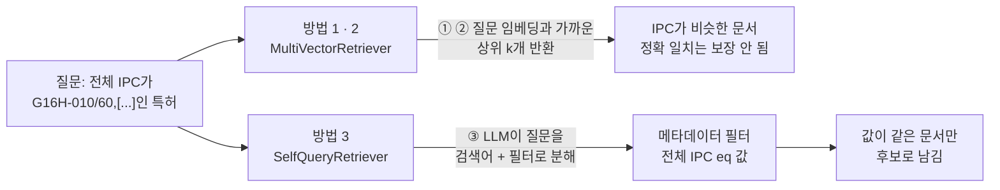
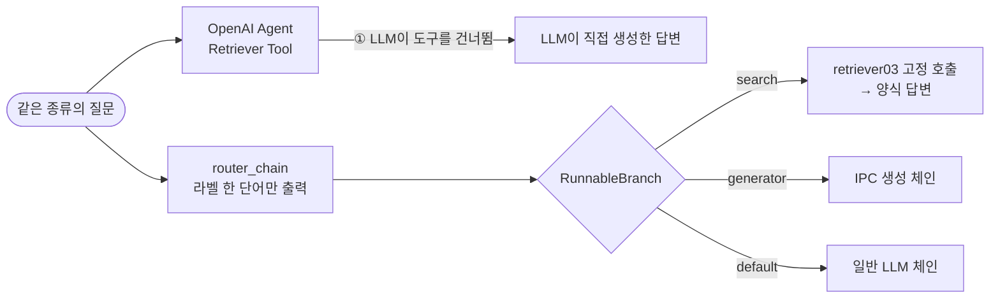
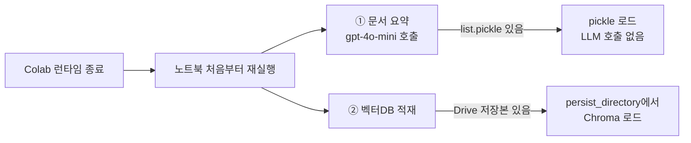

# 특허 검색 · IPC 코드 생성 RAG 시스템

특허 3,006건을 벡터DB에 넣고, 질문 의도에 따라 기존 특허 조회와 새 발명의 IPC 코드 생성을 하나의 질의 함수로 처리하는 시스템입니다.

<p>
  
  
  
  
  
</p>

특허 문서에는 성격이 다른 두 종류의 값이 섞여 있습니다. 발명의 명칭이나 요약, 대표청구항은 긴 글이라 의미로 찾아야 합니다. 반면 출원번호와 전체 IPC, 출원인, 법적상태는 글자 단위로 정확히 맞아야 합니다. 이 시스템은 두 조건을 나눠 입력하지 않아도 한 질의에서 처리합니다. 여기에 아직 출원하지 않은 발명의 설명을 넣으면 IPC 코드를 만들어 주는 경로를 붙였습니다.

## 개요

| 항목 | 내용 |
| --- | --- |
| 기간 | 2024.09 ~ 2024.11 |
| 인원과 본인 역할 | 2인 팀. 본인은 검색과 생성 로직 코드 전체를 맡았고, 팀원은 데이터 라벨링과 데이터 파악을 맡았습니다 |
| 상태 | 완료 (Colab 노트북 1개, 출력 제거본) |
| 수상 | 강남대학교 데이터사이언스전공 DS학술제 모델링 경진대회 장려상 (2024.11) |
| 핵심 기술 | LangChain 0.3 (`SelfQueryRetriever` · `MultiVectorRetriever` · LCEL `RunnableBranch`), ChromaDB, `jhgan/ko-sroberta-multitask`, OpenAI `gpt-4-turbo-preview` · `gpt-4o-mini` |

## 아키텍처


```mermaid
flowchart TD
    A[Train.xlsx + Valid.xlsx] --> B[병합 · 결측치 점검 · 중복 제거]
    B --> C[행 단위 Document 변환<br/>메타데이터 8개 · UUID 부여]
    C --> D{Retriever 전략 비교<br/>공통 테스트 질의}

    D --> E1[방법1 요약 기반<br/>Multi-Vector]
    D --> E2[방법2 600자·300자 청크<br/>Multi-Vector]
    D --> E3[방법3 메타데이터 기반<br/>Self-Query · 채택]

    E1 -.->|검증| AG[Retriever Tool + Agent]
    E2 -.->|검증| AG

    E3 --> F[Router Chain<br/>GPT-4 Turbo]
    U([사용자 질문]) --> F
    F -->|search| G[검색 체인<br/>질의 보강 → Retriever → 양식화된 답변]
    F -->|generator| H[IPC 생성 체인<br/>LLM 단독]
    F -->|default| I[일반 LLM 체인]
```

라우터가 질문을 `search` · `generator` · `default` 중 하나로 분류하면, 코드가 그 이름대로 체인을 나눕니다. 검색 체인은 Self-Query Retriever로 문서를 찾고, 생성 체인은 검색 없이 LLM이 IPC 코드와 부여 사유를 만듭니다.

## 기술 스택

| 구분 | 기술 | 선택한 이유 |
| --- | --- | --- |
| 언어 · 데이터 | Python, pandas, openpyxl | 대회 데이터가 엑셀 형식이었습니다 |
| 프레임워크 | LangChain 0.3 (LCEL, Agents, Retrievers, `RunnableBranch`) | Retriever 여러 종을 같은 인터페이스로 바꿔 끼우며 비교하려고 썼습니다 |
| 벡터 저장 | ChromaDB (디스크 영구 저장), `LocalFileStore` | Colab 런타임이 끊겨도 Drive에 남은 벡터DB를 다시 불러 쓰려고 썼습니다 |
| 모델 | OpenAI `gpt-4-turbo-preview` (Agent · Self-Query · Router · 생성), `gpt-4o-mini` (문서 요약) | 요약은 건수가 많아 저렴한 모델로, 질의 분해와 생성은 상위 모델로 나눴습니다 |
| 임베딩 | `jhgan/ko-sroberta-multitask` | 특허 원문이 한국어라 한국어 문장 임베딩을 썼습니다 |
| 환경 | Google Colab + Google Drive | |

## 문제 해결 사례

1. [IPC 코드처럼 정확히 일치해야 하는 값을 임베딩 유사도로 못 찾던 문제를 메타데이터 필터로 해결](#1-ipc-코드처럼-정확히-일치해야-하는-값을-임베딩-유사도로-못-찾던-문제를-메타데이터-필터로-해결)
2. [Agent가 조회와 생성 경로를 일정하게 고르지 못하던 문제를 라우터 체인으로 해결](#2-agent가-조회와-생성-경로를-일정하게-고르지-못하던-문제를-라우터-체인으로-해결)
3. [재실행마다 요약 API를 다시 부르던 문제를 캐싱으로 해결](#3-재실행마다-요약-api를-다시-부르던-문제를-캐싱으로-해결)

### 1. IPC 코드처럼 정확히 일치해야 하는 값을 임베딩 유사도로 못 찾던 문제를 메타데이터 필터로 해결

**문제 흐름**


```mermaid
flowchart LR
  Q["질문: 전체 IPC가<br/>G16H-010/60,[...]인 특허"] --> M12["방법 1 · 2<br/>MultiVectorRetriever"]
  M12 -->|"① ② 질문 임베딩과 가까운<br/>상위 k개 반환"| X["IPC가 비슷한 문서<br/>정확 일치는 보장 안 됨"]
  Q --> M3["방법 3<br/>SelfQueryRetriever"]
  M3 -->|"③ LLM이 질문을<br/>검색어 + 필터로 분해"| F["메타데이터 필터<br/>전체 IPC eq 값"]
  F --> O["값이 같은 문서만<br/>후보로 남김"]
```

**문제 원인**
- 배경: 경진대회 과제에 전체 IPC가 `G16H-010/60,[G06Q-010/10, G16H-010/20, G16H-080/00]`와 정확히 일치하는 특허를 찾는 질의가 있었음
- 방법 1(요약)과 방법 2(청크)는 비슷한 문서는 찾지만 전체 IPC가 질문과 같은지는 보장하지 못함
- ① 임베딩 텍스트 뒤에 붙인 IPC 문자열은 벡터에서 작은 비중이라 `G16H-010/60`과 `G16H-010/20`의 차이가 거리에 드러나지 않음
- ② 유사도 검색은 일치하는 문서가 없어도 가장 가까운 k개를 항상 돌려줌
- ③ 방법 1 · 2에는 검색할 때 메타데이터 필터를 거는 단계가 없었음

**해결 과정**
- ①② 정확 일치 조건을 임베딩이 아닌 메타데이터 필터로 넘기도록 방법 3을 설계함
- ③ 22개 컬럼 전체를 본문으로, 8개 필드(`doc_id` · `메인IPC2` · `전체 IPC` · 출원번호 · 등록번호 · 출원인 · 발명자 · 법적상태)를 metadata로 넣고 `SelfQueryRetriever`를 올림
- `AttributeInfo`에 필드 뜻을 적고, IPC가 들어온 질문이면 `전체 IPC`로 정확 일치 필터를 만들도록 지시함

**테스트**
- 환경: Colab, 같은 테스트 질의 세트를 세 Retriever에 넣고 반환 문서를 직접 확인
- 전체 IPC 정확 일치, 부가 코드가 긴 IPC 조회, 발명 설명문 검색, 메타 조건, 주제 검색 다섯 유형으로 비교함

> ✅ **결과** 긴 IPC 문자열이 메타데이터 필터로 바뀌어 전체 IPC가 정확히 일치하는 특허가 반환됨
>
> **배운 점** 정확히 같아야 하는 값은 임베딩 텍스트에 붙여 두지 말고 메타데이터 필터로 넘겨야 함

---

### 2. Agent가 조회와 생성 경로를 일정하게 고르지 못하던 문제를 라우터 체인으로 해결

**문제 흐름**


```mermaid
flowchart LR
  Q(["같은 종류의 질문"]) --> AG["OpenAI Agent<br/>Retriever Tool"]
  AG -->|"① LLM이 도구를 건너뜀"| G["LLM이 직접 생성한 답변"]
  Q --> R["router_chain<br/>라벨 한 단어만 출력"]
  R --> B{"RunnableBranch"}
  B -->|search| S["retriever03 고정 호출<br/>→ 양식 답변"]
  B -->|generator| GN["IPC 생성 체인"]
  B -->|default| D["일반 LLM 체인"]
```

**문제 원인**
- 배경: Retriever를 `create_retriever_tool`로 감싸 OpenAI Functions Agent에 넘김
- 같은 종류의 질문에도 Retriever로 조회할 때와 LLM이 직접 답을 지어낼 때가 섞임
- ① Tool을 부를지를 매 질문마다 LLM이 정했고, 프롬프트를 두 차례 고쳐도 "정보가 없으면 직접 생성"이라는 탈출구가 남아 있었음

**해결 과정**
- ① LLM의 역할을 `search` · `generator` · `default` 라벨 하나만 내는 `router_chain`으로 줄임
- `RunnableBranch`가 라벨을 소문자 부분 문자열로 비교해 체인을 고르도록 함
- `search` 체인은 `retriever03`(Self-Query) 호출을 코드에 고정해 검색을 건너뛸 수 없게 하고, `generator` 체인은 IPC 코드를 최대 10개 부여 사유와 함께 생성함

**테스트**
- 환경: Colab, 라우터 결과만 반환하는 `router01_chain`으로 모호한 질의의 분류를 먼저 확인
- 전체 IPC가 질문과 정확히 일치하는 특허 조회, 발명 설명으로 유사 특허 조회, 출원인 조건 조회, 발명 설명으로 IPC 생성 네 가지 경로를 확인

> ✅ **결과** 질문이 search · generator · default 중 하나로 분기되고 조회 질문은 항상 Retriever를 거침
>
> **배운 점** LLM에게서는 라벨만 받고 실행은 코드로 나누자 검색 경로가 고정됨

---

### 3. 재실행마다 요약 API를 다시 부르던 문제를 캐싱으로 해결

**문제 흐름**


```mermaid
flowchart LR
  C["Colab 런타임 종료"] --> R["노트북 처음부터 재실행"]
  R --> S["① 문서 요약<br/>gpt-4o-mini 호출"]
  S -->|"list.pickle 있음"| K["pickle 로드<br/>LLM 호출 없음"]
  R --> V["② 벡터DB 적재"]
  V -->|"Drive 저장본 있음"| D["persist_directory에서<br/>Chroma 로드"]
```

**문제 원인**
- 배경: 개발 환경이 Google Colab이라 런타임이 끊기면 메모리의 변수와 객체가 모두 사라짐
- 재실행마다 요약과 벡터DB 적재를 다시 해야 해 Retriever 3종 비교를 반복하기 어려움
- ① 특허마다 `gpt-4o-mini`를 호출하는 요약 단계가 매번 전체 건수만큼 비용과 시간을 씀
- ② 적재 셀을 다시 실행하면 Chroma 컬렉션에 같은 문서가 한 번 더 추가됨

**해결 과정**
- ① 요약을 `batch(docs, {"max_concurrency": 5})`로 병렬 실행하고 결과를 `list.pickle`로 Drive에 저장함
- ② 방법마다 Chroma `persist_directory`와 컬렉션 이름을 따로 두고 원문 저장소도 `LocalFileStore`로 디스크에 남김
- 생성 셀 제목에 "벡터DB가 저장되어 있다면 SKIP"을 적어 저장본이 있으면 불러오기 셀만 실행하게 함

**테스트**
- 환경: Colab, 요약 직후와 pickle을 불러온 뒤 각각 `len(summaries)`가 문서 수와 맞는지 확인
- 저장된 경로로 벡터DB를 다시 연결한 상태에서 Retriever 질의를 이어서 실행함

> ✅ **결과** 재실행할 때 요약 API를 다시 부르지 않고 저장된 벡터DB로 Retriever 비교 실험을 이어감
>
> **배운 점** 한 번 만든 요약을 저장해 쓰면 비용이 줄고 Retriever 비교 조건도 같게 유지됨

## 역할과 기여도

2인 팀에서 검색과 생성 로직 코드 전체를 담당했습니다. 데이터 라벨링과 데이터 파악은 팀원이 맡았습니다.

- 특허 3,006건(22개 컬럼)을 행 단위 Document로 바꾸고, 메타데이터 8개 필드와 UUID를 설계했습니다.
- Retriever 3종을 직접 구현하고 같은 테스트 질의 세트로 비교해 방식을 정했습니다.
- `AttributeInfo`로 각 필드의 뜻을 기술해 LLM이 질문을 의미 검색어와 필터로 분해하게 했습니다.
- 방법 1 · 2에서는 청크마다 IPC · 출원번호 메타 문자열을 붙이고 UUID로 원문과 연결했습니다. 어느 조각이 검색되든 원문 전체를 돌려주도록 `MultiVectorRetriever`를 직접 구성했습니다.
- Agent를 `RunnableBranch` 라우터 체인으로 바꿔, 조회로 분류된 질문은 반드시 Retriever를 거치게 했습니다.
- IPC 생성 체인이 코드마다 한글 분류명과 부여 사유를 함께 내도록 프롬프트에 출력 양식을 지정했습니다.
- 요약 병렬 처리와 pickle 캐싱, 방법별 벡터DB의 Drive 영구 저장으로 재실행 때 요약 API 호출을 없앴습니다.

## 실행 방법

1. Google Colab에서 `RAG_Modeling.ipynb`를 열고, Drive 작업 경로(`/content/drive/MyDrive/Colab Notebooks/testdata/contest/`)에 대회 데이터(Train · Valid 엑셀)를 넣습니다.
2. 노트북의 `pip install -U` 셀 대신 `pip install -r requirements.txt`를 실행합니다. LangChain 1.0에서 제거된 API를 쓰므로 0.3.x로 고정돼 있습니다.
3. Colab 보안 비밀에 `OPENAI_API_KEY`를 등록합니다. Colab 밖에서는 `.env.example`을 `.env`로 복사해 채웁니다.
4. Ⅰ(데이터 정제)과 Ⅲ(벡터 환경 구성)을 실행합니다. 최종 체인이 쓰는 방법 3은 반드시 실행한 뒤 `question("질문")`으로 질의합니다. 저장된 벡터DB와 `list.pickle`이 있으면 생성 셀을 건너뛰고 불러옵니다.

## 프로젝트 구조 · 보안

```
Patent_Classification/
├── RAG_Modeling.ipynb      # 전처리 → 벡터DB → Retriever → Agent/Chain, 출력 제거본
├── requirements.txt        # 의존성 목록 (LangChain 0.3.x 고정)
├── .env.example            # 환경변수 템플릿
├── .githooks/pre-commit    # 커밋 전 API 키 유출 검사
└── README.md
```

- `.env`, 대회 데이터(`data/`, `*.xlsx`), 벡터DB(`store/`), 요약 캐시(`*.pickle`)는 `.gitignore`로 제외됩니다.
- 클론 후 `git config core.hooksPath .githooks`를 실행하면 커밋할 때 API 키 패턴과 `.env` 파일을 검사합니다.
